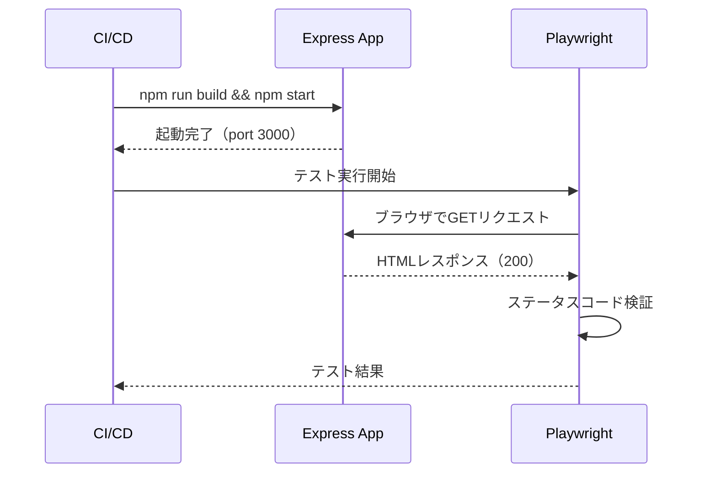

# E2Eテスト - 内部設計書

## 文書情報
- **作成日**: 2026-04-14
- **バージョン**: 1.0
- **ステータス**: Draft

## 変更履歴
| 日付 | バージョン | 変更者 | 変更内容 |
|------|----------|--------|---------|
| 2026-04-14 | 1.0 | - | 初版作成 |

---

## 1. 技術スタック

| 役割 | ツール | 理由 |
|------|--------|------|
| ブラウザ自動操作 | @playwright/test | Node.js/TypeScriptネイティブ対応・スクショ・動画生成が可能 |
| テストフレームワーク | @playwright/test | Playwright公式TypeScript対応 |

---

## 2. プロジェクト構成

```
e2e/
├── app.spec.ts         ← ヘルスチェック・基本ルート
└── features.spec.ts    ← RAG系・Agent系・Chatbot・その他機能

playwright.config.ts    ← Playwright設定
```

---

## 3. テスト実行方法

### 3.1 前提条件

- Node.js インストール済み
- `npm install` 済み
- Playwrightブラウザが初回インストール済みであること

### 3.2 Playwrightブラウザのインストール（初回のみ）

```bash
npx playwright install
```

### 3.3 テスト実行

```bash
# 全E2Eテストを実行
npm run test:e2e

# UIモードで実行（デバッグ時）
npm run test:e2e:ui

# ブラウザを表示しながら実行
npm run test:e2e:headed
```

### 3.4 出力物の確認

テスト実行後、以下のフォルダに自動生成される。

```
playwright-report/    ← HTMLレポート
test-results/         ← スクリーンショット・動画（失敗時）
```

---

## 4. Playwright設定

### 4.1 ベースURL

```typescript
// playwright.config.ts
use: {
  baseURL: 'http://localhost:3000',
}
```

### 4.2 webServer設定

テスト実行前にアプリをビルド・起動する。

```typescript
webServer: {
  command: 'npm run build && npm start',
  url: 'http://localhost:3000',
  reuseExistingServer: !process.env.CI,
  timeout: 120 * 1000,
},
```

### 4.3 スクリーンショット・動画

失敗時に自動生成される。

```typescript
use: {
  trace: 'on-first-retry',  // リトライ時にトレース取得
}
```

---

## 5. テスト命名規則

```
{機能名} {操作内容}が{期待結果}
```

例：
- `product-catalog ページが200を返す`
- `basic-agent /health が200を返す`

---

## 6. 外部API（Claude/Gemini/Supabase）を呼ぶエンドポイントの扱い

RAG・Agent系のAPIエンドポイント（POST /search 等）は外部APIを呼ぶため、E2Eテストの対象外とする。

| テスト対象 | 内容 |
|-----------|------|
| ✅ GETエンドポイント（HTMLページ） | ステータスコード200を確認 |
| ✅ プレースホルダーページ | ステータスコード200を確認 |
| ✅ ヘルスチェックAPI | ステータスコード200を確認 |
| ❌ POSTエンドポイント（外部API呼び出し） | 単体テスト・手動確認で担保 |

---

## 7. シーケンス図



---

## 8. CI/CD連携

```yaml
# GitHub Actions（概要）
- name: E2Eテスト実行
  run: npm run test:e2e

- name: テスト証跡をアーティファクトとして保存
  uses: actions/upload-artifact@v3
  with:
    name: e2e-evidence
    path: |
      playwright-report/
      test-results/
```

---

## 9. 参考

- [E2Eテスト外部設計書](e2e-test-external.md)
- [テスト設計（共通）](testing.md)
