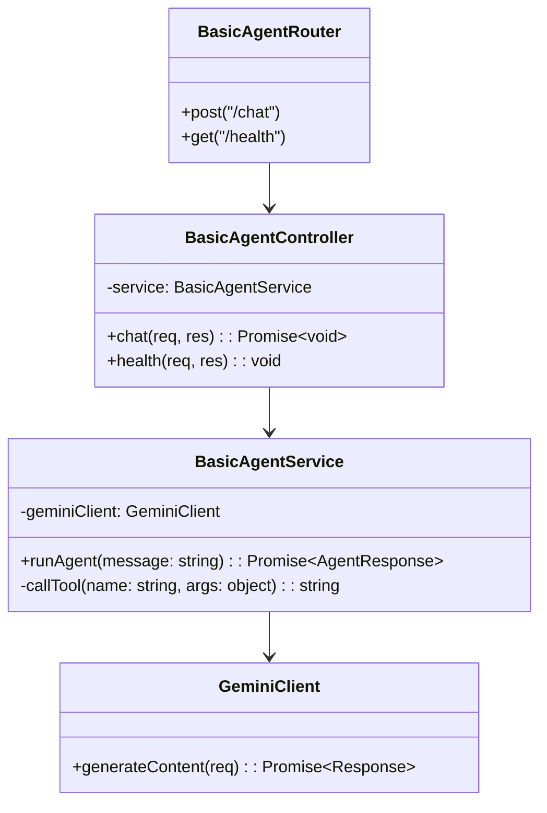
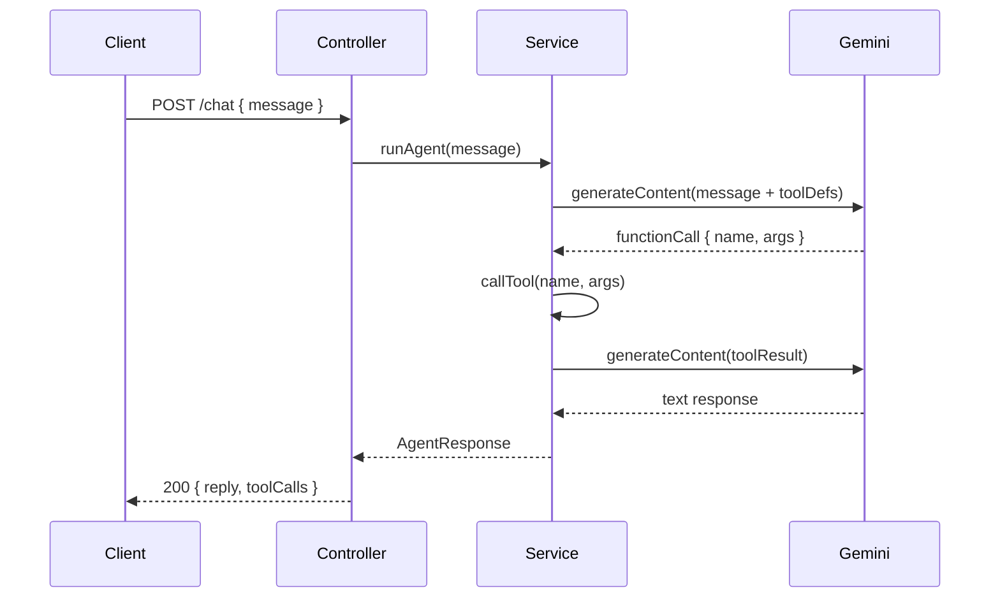

# 外部設計書 - 天気・計算・時刻エージェント

## 概要

Gemini API の Function Calling を使い、天気取得・四則演算・現在時刻の 3 ツールを持つシンプルなエージェント。

## 0. 画面モック

```
┌──────────────────────────────────────────────────────┐
│ [← Back to Home]  [GitHub Source #68]  [設計書]      │
├──────────────────────────────────────────────────────┤
│ 天気・計算・時刻エージェントデモ                       │
├──────────────────────────────────────────────────────┤
│ メッセージを送信:                                     │
│ ┌────────────────────────────────────────────────┐   │
│ │ 東京の天気を教えて                              │   │
│ └────────────────────────────────────────────────┘   │
│ [東京の天気] [100+200×3] [今の時刻] [天気+時刻]      │
│                              [送信する]               │
│                                                      │
│ エージェント応答:                                     │
│ ┌────────────────────────────────────────────────┐   │
│ │ 東京の天気は晴れ、気温 22°C です。              │   │
│ └────────────────────────────────────────────────┘   │
│                                                      │
│ ツール呼び出しログ:                                   │
│ ┌────────────────────────────────────────────────┐   │
│ │ [1] get_weather({"city":"東京"})               │   │
│ │     → "晴れ, 22°C"                            │   │
│ └────────────────────────────────────────────────┘   │
│                                    処理時間: 1200ms  │
└──────────────────────────────────────────────────────┘
```

## 画面設計

### エンドポイント一覧

| メソッド | パス | 説明 |
|---------|------|------|
| POST | /node/agent/basic/chat | エージェントへメッセージ送信 |
| GET | /node/agent/basic/health | ヘルスチェック |

### リクエスト / レスポンス

#### POST /node/agent/basic/chat

**Request Body**
```json
{
  "message": "東京の天気を教えて"
}
```

**Response Body**
```json
{
  "reply": "東京の天気は晴れ、気温 22°C です。",
  "toolCalls": [
    { "name": "get_weather", "args": { "city": "東京" }, "result": "晴れ, 22°C" }
  ]
}
```

## クラス図



## シーケンス図



## ツール定義一覧

| ツール名 | 引数 | 戻り値 |
|---------|------|--------|
| get_weather | city: string | 天気・気温の文字列 |
| calculate | expression: string | 計算結果の文字列 |
| get_current_time | - | ISO 8601 形式の現在時刻 |
