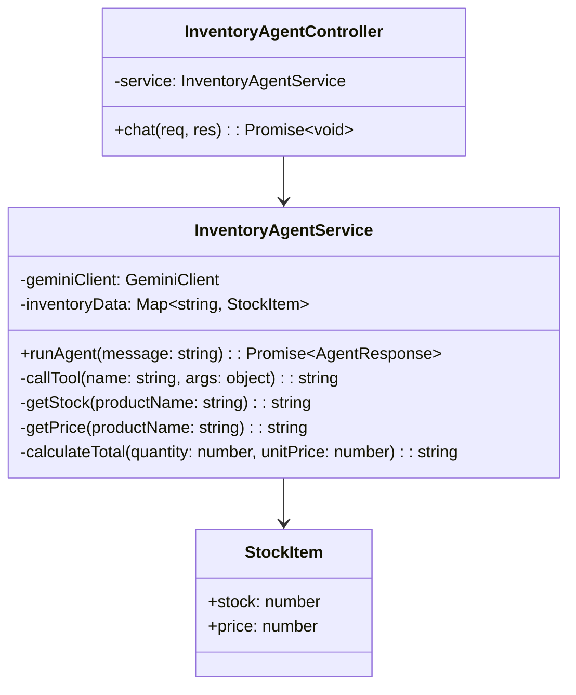
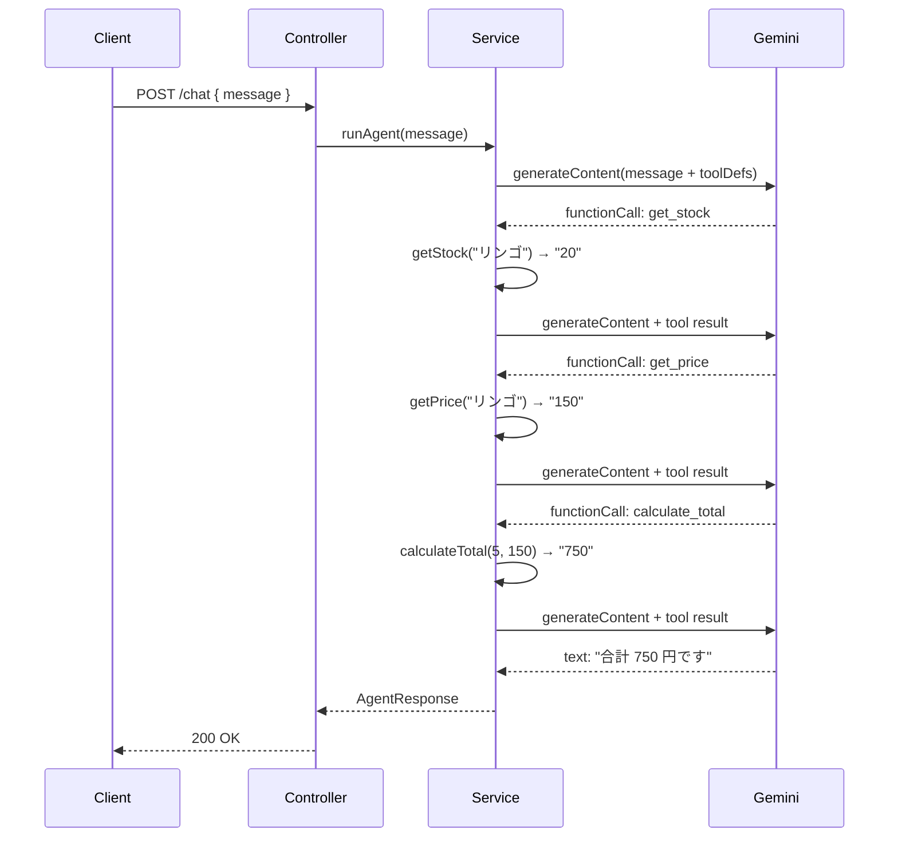

# 外部設計書 - 在庫確認エージェント

## 概要

get_stock（在庫数）/ get_price（単価）/ calculate_total（合計金額）の 3 ツールをダミーデータで動作させる在庫確認エージェント。

## 0. 画面モック

```
│ [← Back to Home]  [GitHub Source #69]  [設計書]      │
├──────────────────────────────────────────────────────┤
┌──────────────────────────────────────────────────────┐
│ 在庫確認エージェントデモ                               │
├──────────────────────────────────────────────────────┤
│ 在庫について質問してください:                          │
│ ┌────────────────────────────────────────────────┐   │
│ │ リンゴを5個買いたい。在庫はある？合計金額は？   │   │
│ └────────────────────────────────────────────────┘   │
│                              [送信する]               │
│                                                      │
│ エージェント応答:                                     │
│ ┌────────────────────────────────────────────────┐   │
│ │ リンゴの在庫は20個あります。                    │   │
│ │ 5個の合計金額は 750円 です。                    │   │
│ └────────────────────────────────────────────────┘   │
│                                                      │
│ ツール呼び出しログ:                                   │
│ ┌────────────────────────────────────────────────┐   │
│ │ [1] get_stock(productName: "リンゴ") → "20"    │   │
│ │ [2] get_price(productName: "リンゴ") → "150"   │   │
│ │ [3] calculate_total(qty: 5, price: 150) → "750"│   │
│ └────────────────────────────────────────────────┘   │
│                                                      │
│ 他の質問例:                                           │
│ [バナナの在庫] [ぶどうを3個購入] [全商品の在庫確認]   │
└──────────────────────────────────────────────────────┘
```

## エンドポイント一覧

| メソッド | パス | 説明 |
|---------|------|------|
| POST | /node/agent/inventory/chat | 在庫確認エージェントへの問い合わせ |
| GET | /node/agent/inventory/health | ヘルスチェック |

### リクエスト / レスポンス

#### POST /node/agent/inventory/chat

**Request Body**
```json
{
  "message": "リンゴを 5 個買いたい。在庫はある？合計金額は？"
}
```

**Response Body**
```json
{
  "reply": "リンゴの在庫は 20 個あります。5 個の合計金額は 750 円です。",
  "toolCalls": [
    { "name": "get_stock",       "args": { "productName": "リンゴ" }, "result": "20" },
    { "name": "get_price",       "args": { "productName": "リンゴ" }, "result": "150" },
    { "name": "calculate_total", "args": { "quantity": 5, "unitPrice": 150 }, "result": "750" }
  ]
}
```

## クラス図



## シーケンス図



## ダミーデータ仕様

| 商品名 | 在庫数 | 単価（円） |
|--------|--------|-----------|
| リンゴ | 20 | 150 |
| バナナ | 50 | 80 |
| オレンジ | 15 | 120 |
| ぶどう | 8 | 300 |
| 桃 | 3 | 250 |
