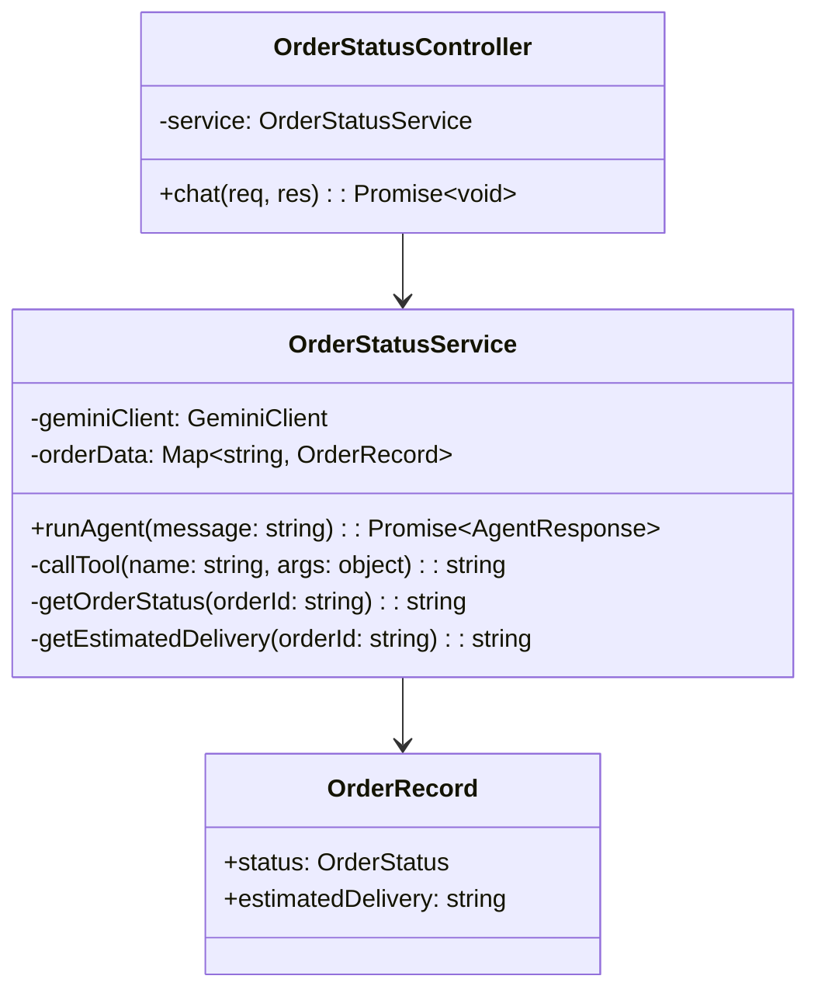
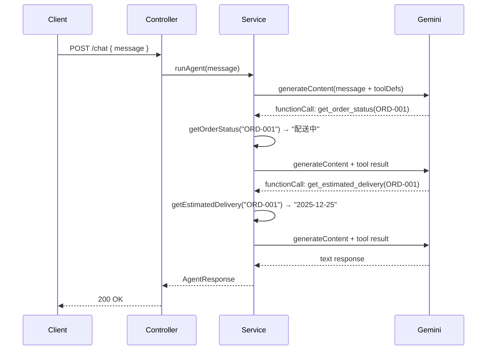

# 外部設計書 - 注文ステータス確認エージェント

## 概要

get_order_status（注文ID→ステータス）/ get_estimated_delivery（注文ID→配送予定日）の 2 ツールでダミーデータを返す注文確認エージェント。

## 0. 画面モック

```
│ [← Back to Home]  [GitHub Source #70]  [設計書]      │
├──────────────────────────────────────────────────────┤
┌──────────────────────────────────────────────────────┐
│ 注文ステータス確認エージェントデモ                     │
├──────────────────────────────────────────────────────┤
│ 注文について質問してください:                          │
│ ┌────────────────────────────────────────────────┐   │
│ │ 注文 ORD-001 の状況を教えてください             │   │
│ └────────────────────────────────────────────────┘   │
│                              [送信する]               │
│                                                      │
│ エージェント応答:                                     │
│ ┌────────────────────────────────────────────────┐   │
│ │ 注文 ORD-001 は現在「配送中」です。             │   │
│ │ 配送予定日は 2025-12-25 です。                  │   │
│ └────────────────────────────────────────────────┘   │
│                                                      │
│ ツール呼び出しログ:                                   │
│ ┌────────────────────────────────────────────────┤   │
│ │ [1] get_order_status("ORD-001") → "配送中"     │   │
│ │ [2] get_estimated_delivery("ORD-001")           │   │
│ │     → "2025-12-25"                             │   │
│ └────────────────────────────────────────────────┘   │
│                                                      │
│ 注文ID一覧: [ORD-001] [ORD-002] [ORD-003] [ORD-004]  │
└──────────────────────────────────────────────────────┘
```

## エンドポイント一覧

| メソッド | パス | 説明 |
|---------|------|------|
| POST | /node/agent/order-status/chat | 注文確認エージェントへの問い合わせ |
| GET | /node/agent/order-status/health | ヘルスチェック |

### リクエスト / レスポンス

#### POST /node/agent/order-status/chat

**Request Body**
```json
{
  "message": "注文 ORD-001 の状況を教えてください"
}
```

**Response Body**
```json
{
  "reply": "注文 ORD-001 は現在「配送中」です。配送予定日は 2025-12-25 です。",
  "toolCalls": [
    { "name": "get_order_status",       "args": { "orderId": "ORD-001" }, "result": "配送中" },
    { "name": "get_estimated_delivery", "args": { "orderId": "ORD-001" }, "result": "2025-12-25" }
  ]
}
```

## クラス図



## シーケンス図



## ダミーデータ仕様

| 注文 ID | ステータス | 配送予定日 |
|--------|-----------|-----------|
| ORD-001 | 配送中 | 2025-12-25 |
| ORD-002 | 処理中 | 2025-12-28 |
| ORD-003 | 配送完了 | 2025-12-20 |
| ORD-004 | キャンセル | - |
| ORD-005 | 注文受付 | 2025-12-30 |
