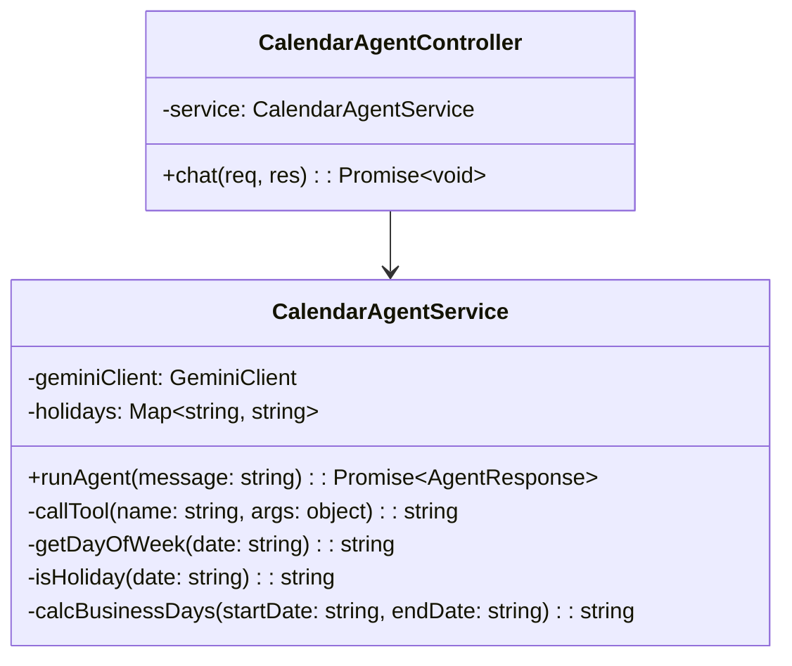
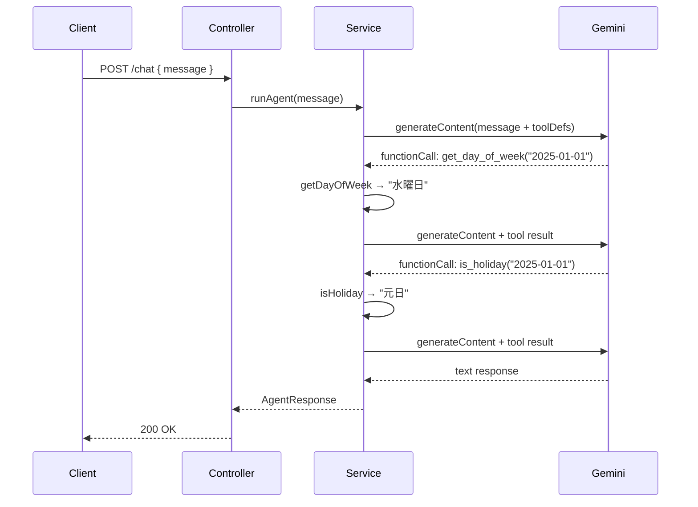

# 外部設計書 - カレンダー確認エージェント

## 概要

get_day_of_week（日付→曜日）/ is_holiday（日付→祝日判定）/ calc_business_days（開始日・終了日→営業日数）の 3 ツールを持つカレンダーエージェント。

## 0. 画面モック

```
│ [← Back to Home]  [GitHub Source #72]  [設計書]      │
├──────────────────────────────────────────────────────┤
┌──────────────────────────────────────────────────────┐
│ カレンダー確認エージェントデモ                         │
├──────────────────────────────────────────────────────┤
│ 日付について質問してください:                          │
│ ┌────────────────────────────────────────────────┐   │
│ │ 2025-01-01 は何曜日で、祝日ですか？             │   │
│ └────────────────────────────────────────────────┘   │
│                              [送信する]               │
│                                                      │
│ エージェント応答:                                     │
│ ┌────────────────────────────────────────────────┐   │
│ │ 2025年1月1日は水曜日で、元日（祝日）です。      │   │
│ └────────────────────────────────────────────────┘   │
│                                                      │
│ ツール呼び出しログ:                                   │
│ ┌────────────────────────────────────────────────┐   │
│ │ [1] get_day_of_week("2025-01-01") → "水曜日"   │   │
│ │ [2] is_holiday("2025-01-01") → "元日"          │   │
│ └────────────────────────────────────────────────┘   │
│                                                      │
│ 質問例:                                               │
│ [2025-01-01は何曜日？] [次の祝日はいつ？]             │
│ [2025-01-01から2025-01-31の営業日数は？]              │
└──────────────────────────────────────────────────────┘
```

## エンドポイント一覧

| メソッド | パス | 説明 |
|---------|------|------|
| POST | /node/agent/calendar/chat | カレンダー確認エージェントへの問い合わせ |
| GET | /node/agent/calendar/health | ヘルスチェック |

### リクエスト / レスポンス

#### POST /node/agent/calendar/chat

**Request Body**
```json
{
  "message": "2025-01-01 は何曜日で、祝日ですか？"
}
```

**Response Body**
```json
{
  "reply": "2025年1月1日は水曜日で、元日（祝日）です。",
  "toolCalls": [
    { "name": "get_day_of_week", "args": { "date": "2025-01-01" }, "result": "水曜日" },
    { "name": "is_holiday",      "args": { "date": "2025-01-01" }, "result": "元日" }
  ]
}
```

## クラス図



## シーケンス図



## ツール定義一覧

| ツール名 | 引数 | 戻り値 |
|---------|------|--------|
| get_day_of_week | date: string (YYYY-MM-DD) | 曜日（月曜日〜日曜日） |
| is_holiday | date: string (YYYY-MM-DD) | 祝日名 または "祝日ではありません" |
| calc_business_days | startDate: string, endDate: string | 営業日数（整数） |
