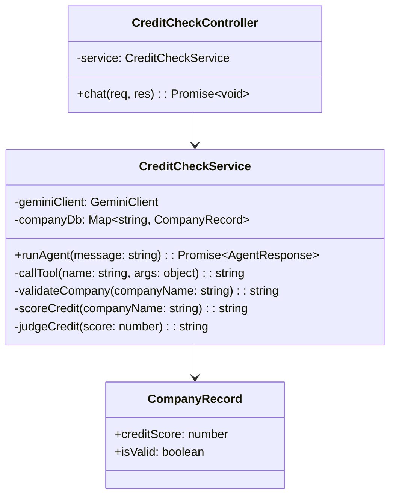
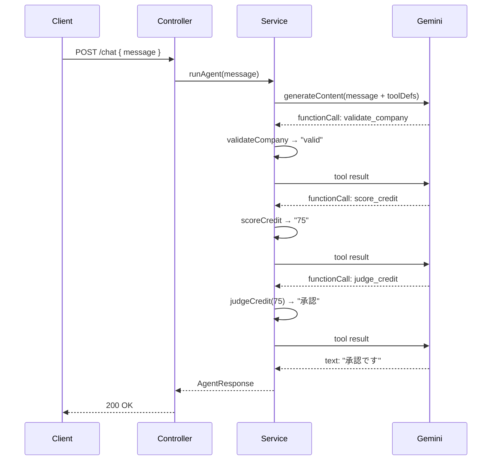

# 外部設計書 - 与信チェックエージェント

## 概要

validate_company（会社名バリデーション）→ score_credit（スコア算出）→ judge_credit（判定）の 3 ツールを連続実行する中級エージェント。

## 0. 画面モック

```
│ [← Back to Home]  [GitHub Source #73]  [設計書]      │
├──────────────────────────────────────────────────────┤
┌──────────────────────────────────────────────────────┐
│ 与信チェックエージェントデモ                           │
├──────────────────────────────────────────────────────┤
│ 与信チェックする会社名を入力:                          │
│ ┌────────────────────────────────────────────────┐   │
│ │ 株式会社サンプルの与信チェックをお願いします     │   │
│ └────────────────────────────────────────────────┘   │
│                              [チェック実行]           │
│                                                      │
│ 処理フロー:                                           │
│  [バリデーション] → [スコア算出] → [判定]             │
│       ✓ valid         75点          承認              │
│                                                      │
│ エージェント応答:                                     │
│ ┌────────────────────────────────────────────────┐   │
│ │ 株式会社サンプルの与信チェック結果:             │   │
│ │ スコア 75点、判定「承認」です。                 │   │
│ └────────────────────────────────────────────────┘   │
│                                                      │
│ ツール呼び出しログ:                                   │
│ ┌────────────────────────────────────────────────┐   │
│ │ [1] validate_company("株式会社サンプル") → "valid"│  │
│ │ [2] score_credit("株式会社サンプル") → "75"    │   │
│ │ [3] judge_credit(75) → "承認"                  │   │
│ └────────────────────────────────────────────────┘   │
└──────────────────────────────────────────────────────┘
```

## エンドポイント一覧

| メソッド | パス | 説明 |
|---------|------|------|
| POST | /node/agent/credit-check/chat | 与信チェック実行 |
| GET | /node/agent/credit-check/health | ヘルスチェック |

### リクエスト / レスポンス

#### POST /node/agent/credit-check/chat

**Request Body**
```json
{
  "message": "株式会社サンプルの与信チェックをお願いします"
}
```

**Response Body**
```json
{
  "reply": "株式会社サンプルの与信チェック結果：スコア 75 点、判定「承認」です。",
  "toolCalls": [
    { "name": "validate_company", "args": { "companyName": "株式会社サンプル" }, "result": "valid" },
    { "name": "score_credit",     "args": { "companyName": "株式会社サンプル" }, "result": "75" },
    { "name": "judge_credit",     "args": { "score": 75 }, "result": "承認" }
  ]
}
```

## クラス図



## シーケンス図



## 判定基準

| スコア範囲 | 判定 |
|-----------|------|
| 80 以上 | 優良承認 |
| 60〜79 | 承認 |
| 40〜59 | 条件付き承認 |
| 39 以下 | 否認 |
