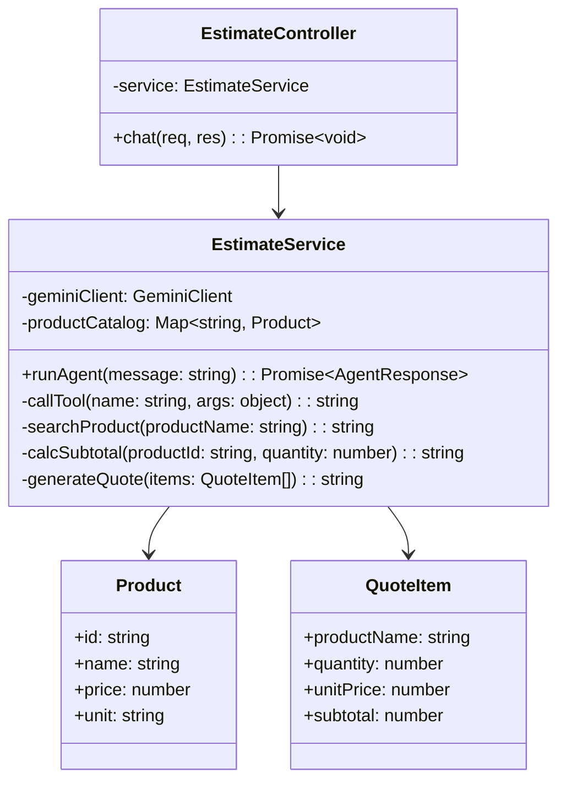
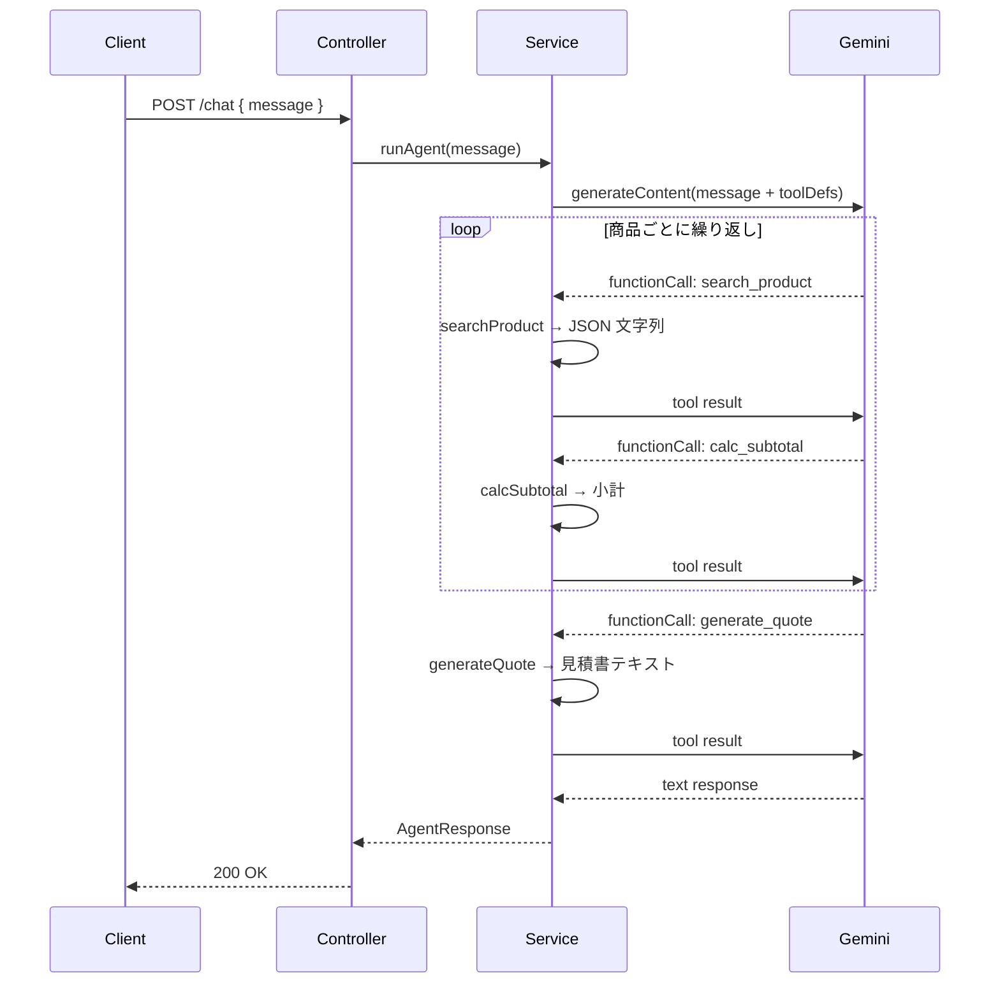

# 外部設計書 - 見積もり作成エージェント

## 概要

search_product（商品検索）→ calc_subtotal（小計計算）→ generate_quote（見積書生成）の 3 ツールで見積書テキストを生成するエージェント。

## 0. 画面モック

```
│ [← Back to Home]  [GitHub Source #74]  [設計書]      │
├──────────────────────────────────────────────────────┤
┌──────────────────────────────────────────────────────┐
│ 見積もり作成エージェントデモ                           │
├──────────────────────────────────────────────────────┤
│ 見積もりの依頼を入力してください:                      │
│ ┌────────────────────────────────────────────────┐   │
│ │ ノートパソコンを2台とマウスを3個の見積もりを    │   │
│ │ 作成してください                                │   │
│ └────────────────────────────────────────────────┘   │
│                              [作成する]               │
│                                                      │
│ ツール呼び出しログ:                                   │
│ ┌────────────────────────────────────────────────┐   │
│ │ [1] search_product("ノートパソコン")            │   │
│ │     → PC-001, ¥120,000                         │   │
│ │ [2] calc_subtotal(PC-001, qty=2) → ¥240,000    │   │
│ │ [3] search_product("マウス")                   │   │
│ │     → ACC-001, ¥2,500                          │   │
│ │ [4] calc_subtotal(ACC-001, qty=3) → ¥7,500     │   │
│ │ [5] generate_quote([...]) → 見積書テキスト      │   │
│ └────────────────────────────────────────────────┘   │
│ 生成された見積書:                                     │
│ ┌────────────────────────────────────────────────┐   │
│ │ 見積書                                         │   │
│ │ ───────────────────────────────                │   │
│ │ ノートパソコン × 2台   ¥240,000                │   │
│ │ マウス         × 3個   ¥  7,500                │   │
│ │ ─────────────────────────────                  │   │
│ │ 合計                   ¥247,500                │   │
│ └────────────────────────────────────────────────┘   │
└──────────────────────────────────────────────────────┘
```

## エンドポイント一覧

| メソッド | パス | 説明 |
|---------|------|------|
| POST | /node/agent/estimate/chat | 見積もり作成エージェントへの問い合わせ |
| GET | /node/agent/estimate/health | ヘルスチェック |

### リクエスト / レスポンス

#### POST /node/agent/estimate/chat

**Request Body**
```json
{
  "message": "ノートパソコンを 2 台とマウスを 3 個の見積もりを作成してください"
}
```

**Response Body**
```json
{
  "reply": "見積書を作成しました。\n\n見積書\n---\nノートパソコン × 2台 = 240,000円\nマウス × 3個 = 7,500円\n合計: 247,500円",
  "toolCalls": [
    { "name": "search_product", "args": { "productName": "ノートパソコン" }, "result": "{\"id\":\"PC-001\",\"name\":\"ノートパソコン\",\"price\":120000}" },
    { "name": "calc_subtotal",  "args": { "productId": "PC-001", "quantity": 2 }, "result": "240000" },
    { "name": "search_product", "args": { "productName": "マウス" }, "result": "{\"id\":\"ACC-001\",\"name\":\"マウス\",\"price\":2500}" },
    { "name": "calc_subtotal",  "args": { "productId": "ACC-001", "quantity": 3 }, "result": "7500" },
    { "name": "generate_quote", "args": { "items": [...] }, "result": "見積書テキスト" }
  ]
}
```

## クラス図



## シーケンス図


