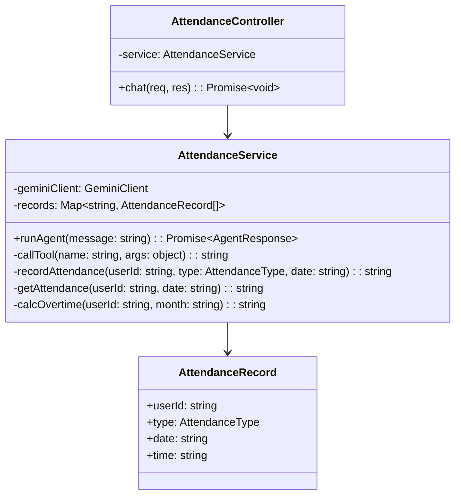
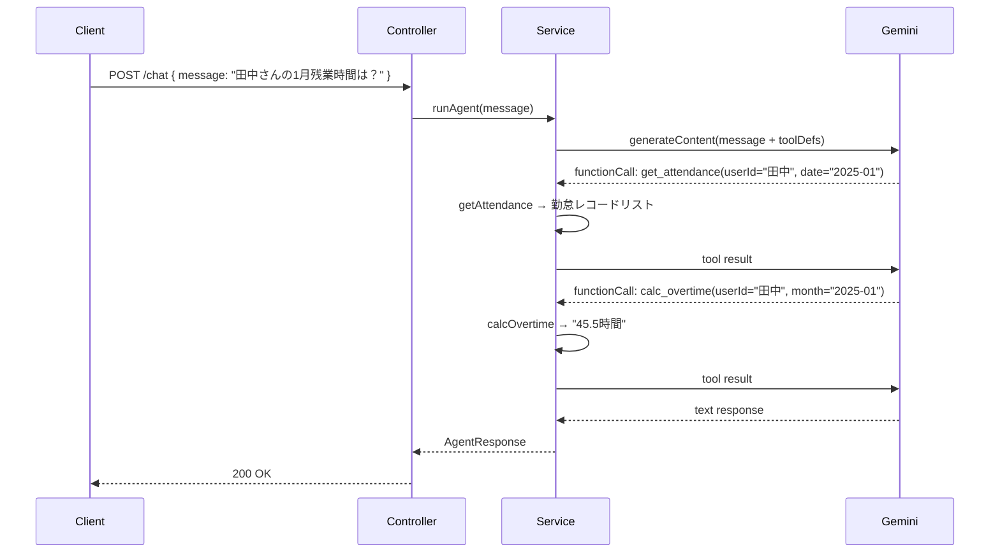

# 外部設計書 - 勤怠管理エージェント

## 概要

record_attendance（勤怠記録）/ get_attendance（勤怠取得）/ calc_overtime（残業時間計算）の 3 ツールを持つ勤怠管理エージェント。インメモリで状態を保持。

## 0. 画面モック

```
│ [← Back to Home]  [GitHub Source #75]  [設計書]      │
├──────────────────────────────────────────────────────┤
┌──────────────────────────────────────────────────────┐
│ 勤怠管理エージェントデモ                               │
├──────────────────────────────────────────────────────┤
│ 勤怠について質問・操作してください:                    │
│ ┌────────────────────────────────────────────────┐   │
│ │ 田中さんの2025-01-15の勤怠を出勤として記録して  │   │
│ └────────────────────────────────────────────────┘   │
│                              [送信する]               │
│                                                      │
│ エージェント応答:                                     │
│ ┌────────────────────────────────────────────────┐   │
│ │ 田中さんの 2025-01-15 の出勤を記録しました。    │   │
│ └────────────────────────────────────────────────┘   │
│                                                      │
│ ツール呼び出しログ:                                   │
│ ┌────────────────────────────────────────────────┐   │
│ │ [1] record_attendance                          │   │
│ │     userId:"田中", type:"出勤", date:"2025-01-15"│  │
│ │     → "記録完了"                               │   │
│ └────────────────────────────────────────────────┘   │
│                                                      │
│ 質問例:                                               │
│ [出勤記録] [退勤記録] [田中さんの1月残業時間は？]     │
│ [2025-01-15の勤怠を確認]                              │
└──────────────────────────────────────────────────────┘
```

## エンドポイント一覧

| メソッド | パス | 説明 |
|---------|------|------|
| POST | /node/agent/attendance/chat | 勤怠エージェントへの問い合わせ |
| GET | /node/agent/attendance/health | ヘルスチェック |

### リクエスト / レスポンス

#### POST /node/agent/attendance/chat

**Request Body**
```json
{
  "message": "田中さんの 2025-01-15 の勤怠を出勤として記録してください"
}
```

**Response Body**
```json
{
  "reply": "田中さんの 2025-01-15 の出勤を記録しました。",
  "toolCalls": [
    {
      "name": "record_attendance",
      "args": { "userId": "田中", "type": "出勤", "date": "2025-01-15" },
      "result": "記録完了"
    }
  ]
}
```

## クラス図



## シーケンス図（残業時間確認フロー）



## 勤怠種別

| 種別 | 説明 |
|------|------|
| 出勤 | 勤務開始 |
| 退勤 | 勤務終了 |
| 有給 | 有給休暇 |
| 欠勤 | 無断欠勤 |
