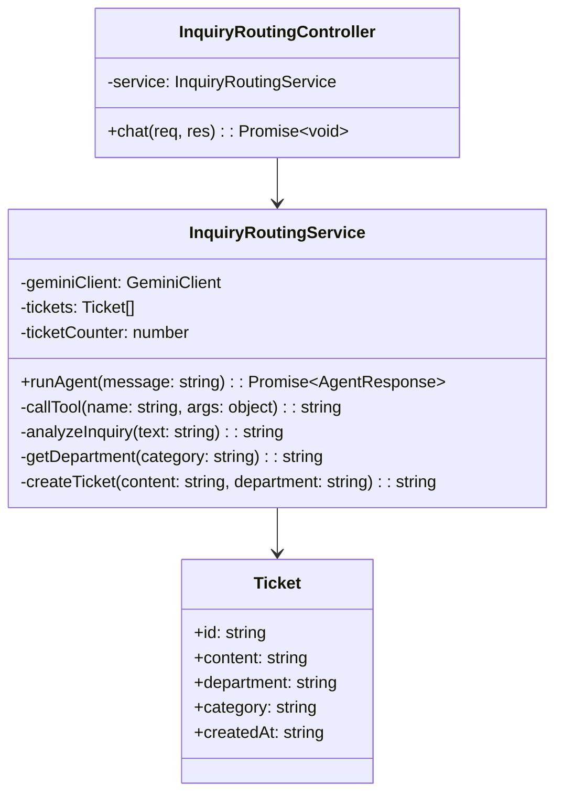
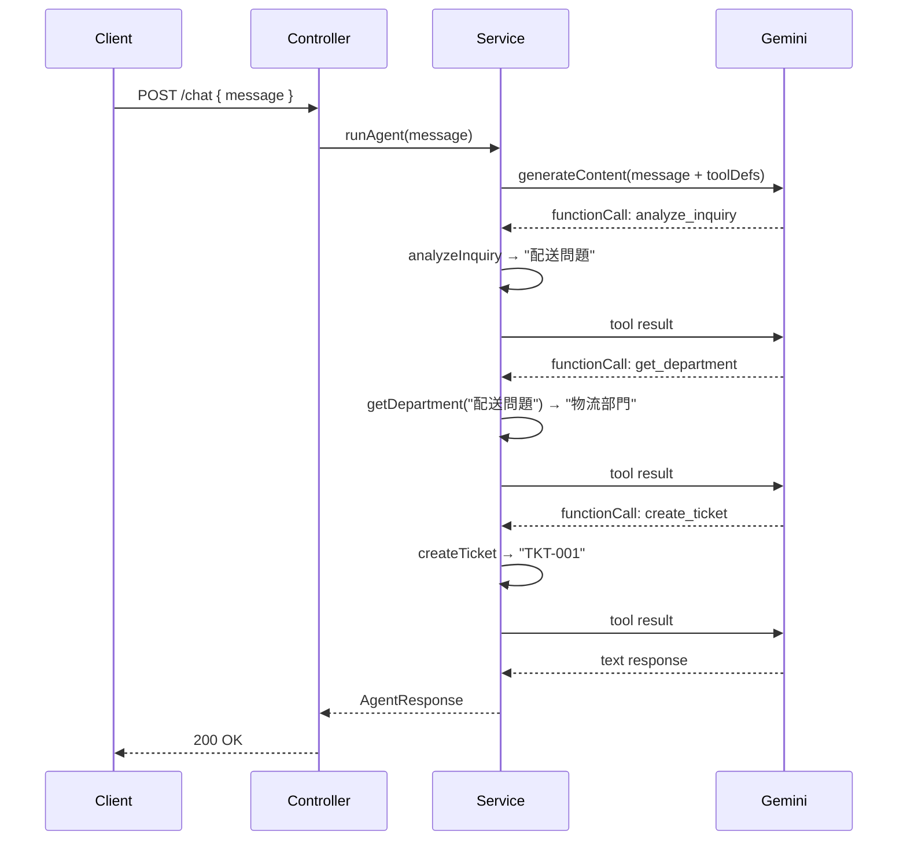

# 外部設計書 - 問い合わせ振り分けエージェント

## 概要

analyze_inquiry（カテゴリ分類）→ get_department（担当部門取得）→ create_ticket（チケット作成）の 3 ツールで問い合わせを自動振り分けするエージェント。

## 0. 画面モック

```
│ [← Back to Home]  [GitHub Source #76]  [設計書]      │
├──────────────────────────────────────────────────────┤
┌──────────────────────────────────────────────────────┐
│ 問い合わせ振り分けエージェントデモ                     │
├──────────────────────────────────────────────────────┤
│ お問い合わせ内容を入力してください:                    │
│ ┌────────────────────────────────────────────────┐   │
│ │ 商品が届いていません。注文番号は ORD-123 です。  │   │
│ └────────────────────────────────────────────────┘   │
│                              [送信する]               │
│                                                      │
│ 振り分けフロー:                                       │
│  [カテゴリ分類]  →  [担当部門取得]  →  [チケット作成] │
│   配送問題          物流部門          TKT-001        │
│                                                      │
│ エージェント応答:                                     │
│ ┌────────────────────────────────────────────────┐   │
│ │ お問い合わせを物流部門に転送し、                │   │
│ │ チケット TKT-001 を作成しました。               │   │
│ └────────────────────────────────────────────────┘   │
│                                                      │
│ ツール呼び出しログ:                                   │
│ ┌────────────────────────────────────────────────┐   │
│ │ [1] analyze_inquiry(...) → "配送問題"          │   │
│ │ [2] get_department("配送問題") → "物流部門"    │   │
│ │ [3] create_ticket(..., "物流部門") → "TKT-001" │   │
│ └────────────────────────────────────────────────┘   │
└──────────────────────────────────────────────────────┘
```

## エンドポイント一覧

| メソッド | パス | 説明 |
|---------|------|------|
| POST | /node/agent/inquiry-routing/chat | 問い合わせ振り分けエージェントへの問い合わせ |
| GET | /node/agent/inquiry-routing/health | ヘルスチェック |

### リクエスト / レスポンス

#### POST /node/agent/inquiry-routing/chat

**Request Body**
```json
{
  "message": "商品が届いていません。注文番号は ORD-123 です。"
}
```

**Response Body**
```json
{
  "reply": "お問い合わせを物流部門に転送し、チケット TKT-001 を作成しました。",
  "toolCalls": [
    { "name": "analyze_inquiry",  "args": { "text": "商品が届いていません..." }, "result": "配送問題" },
    { "name": "get_department",   "args": { "category": "配送問題" }, "result": "物流部門" },
    { "name": "create_ticket",    "args": { "content": "...", "department": "物流部門" }, "result": "TKT-001" }
  ]
}
```

## クラス図



## シーケンス図



## カテゴリ・部門マッピング

| カテゴリ | 担当部門 |
|---------|---------|
| 配送問題 | 物流部門 |
| 商品不良 | 品質管理部門 |
| 請求・支払い | 経理部門 |
| 技術サポート | IT サポート部門 |
| 一般問い合わせ | カスタマーサポート部門 |
