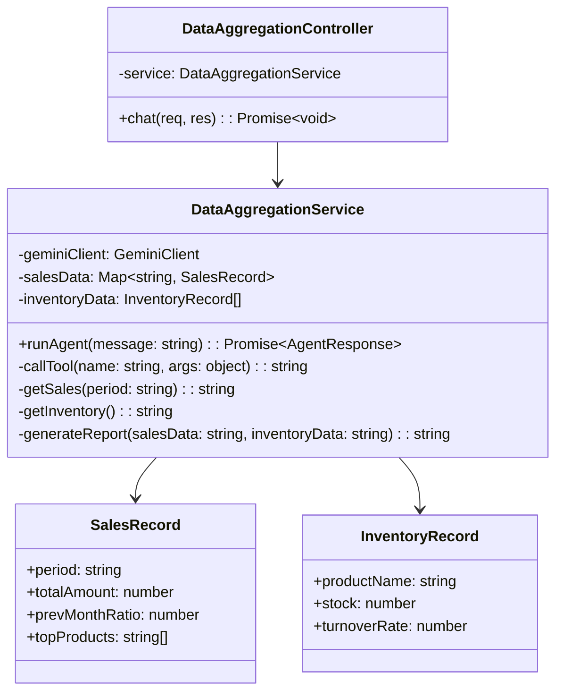
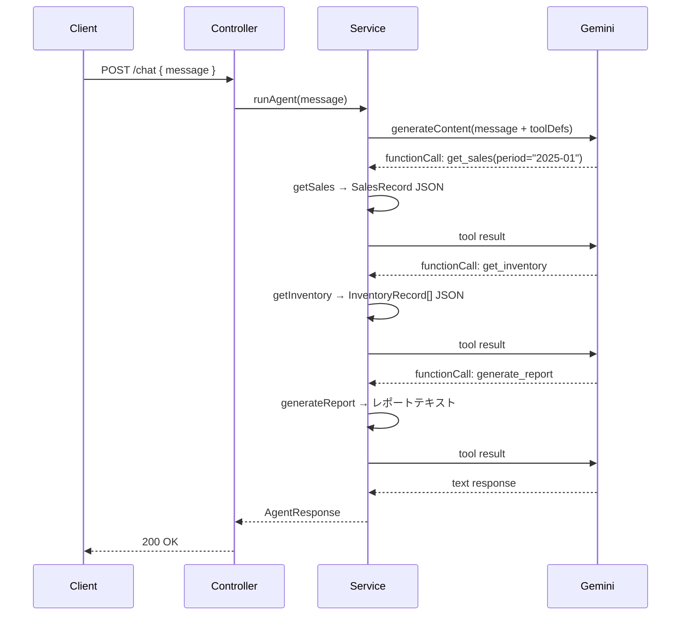

# 外部設計書 - データ集計エージェント

## 概要

get_sales（売上データ取得）/ get_inventory（在庫データ取得）/ generate_report（レポート生成）の 3 ツールで定期レポートを作成するエージェント。

## 0. 画面モック

```
│ [← Back to Home]  [GitHub Source #77]  [設計書]      │
├──────────────────────────────────────────────────────┤
┌──────────────────────────────────────────────────────┐
│ データ集計エージェントデモ                             │
├──────────────────────────────────────────────────────┤
│ レポート作成の依頼を入力してください:                  │
│ ┌────────────────────────────────────────────────┐   │
│ │ 2025年1月の売上と在庫のレポートを作成してください│   │
│ └────────────────────────────────────────────────┘   │
│                              [作成する]               │
│                                                      │
│ ツール呼び出しログ:                                   │
│ ┌────────────────────────────────────────────────┐   │
│ │ [1] get_sales(period: "2025-01")               │   │
│ │     → 売上: ¥1,250,000 (前月比 +5%)            │   │
│ │ [2] get_inventory()                            │   │
│ │     → 在庫回転率: 2.3回                        │   │
│ │ [3] generate_report(salesData, inventoryData)  │   │
│ │     → レポートテキスト生成                      │   │
│ └────────────────────────────────────────────────┘   │
│                                                      │
│ 生成されたレポート:                                   │
│ ┌────────────────────────────────────────────────┐   │
│ │ 2025年1月 月次レポート                          │   │
│ │ ────────────────────────────────               │   │
│ │ 売上: ¥1,250,000  (前月比 +5%)                 │   │
│ │ 在庫回転率: 2.3回 / トップ商品: リンゴ          │   │
│ └────────────────────────────────────────────────┘   │
└──────────────────────────────────────────────────────┘
```

## エンドポイント一覧

| メソッド | パス | 説明 |
|---------|------|------|
| POST | /node/agent/data-aggregation/chat | データ集計エージェントへの問い合わせ |
| GET | /node/agent/data-aggregation/health | ヘルスチェック |

### リクエスト / レスポンス

#### POST /node/agent/data-aggregation/chat

**Request Body**
```json
{
  "message": "2025 年 1 月の売上と在庫のレポートを作成してください"
}
```

**Response Body**
```json
{
  "reply": "2025年1月のレポートを作成しました。\n\n売上: 1,250,000円（前月比 +5%）\n在庫回転率: 2.3 回\n...",
  "toolCalls": [
    { "name": "get_sales",       "args": { "period": "2025-01" }, "result": "..." },
    { "name": "get_inventory",   "args": {},                      "result": "..." },
    { "name": "generate_report", "args": { "salesData": "...", "inventoryData": "..." }, "result": "レポートテキスト" }
  ]
}
```

## クラス図



## シーケンス図


