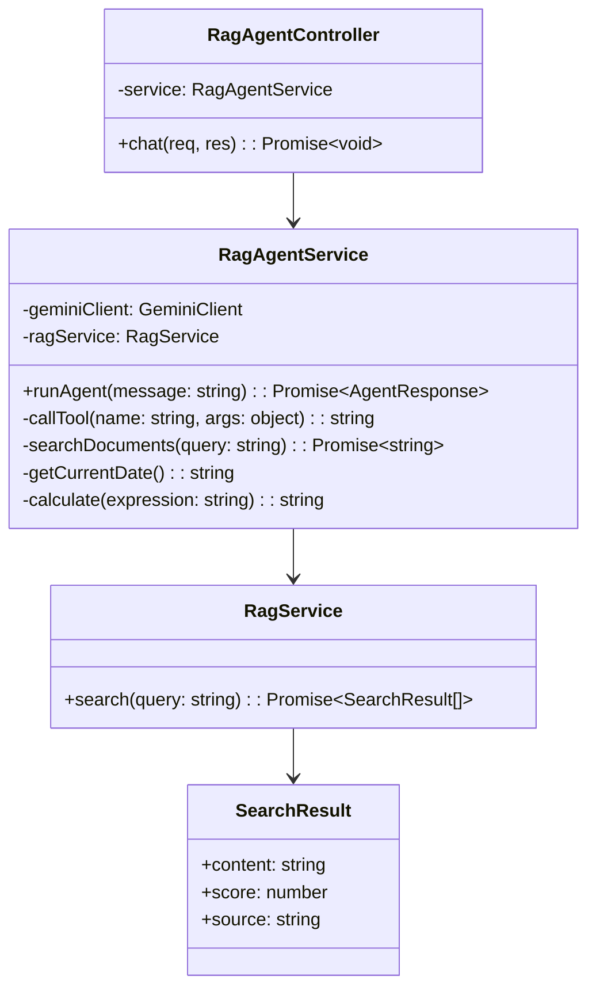
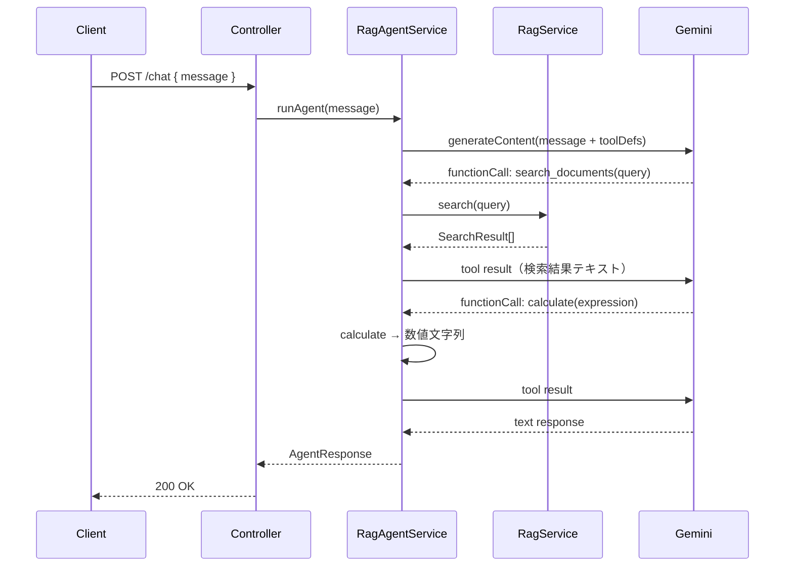

# 外部設計書 - RAG + エージェント連携

## 概要

search_documents（RAG 検索）/ get_current_date（現在日時）/ calculate（計算）の 3 ツールで、RAG サービスを Function Calling のツールとして利用するエージェント。

## 0. 画面モック

```
│ [← Back to Home]  [GitHub Source #78]  [設計書]      │
├──────────────────────────────────────────────────────┤
┌──────────────────────────────────────────────────────┐
│ RAG + エージェント連携デモ                             │
├──────────────────────────────────────────────────────┤
│ 質問してください（社内ドキュメント検索 + 計算）:       │
│ ┌────────────────────────────────────────────────┐   │
│ │ プロジェクトXの予算は何円？残予算も計算して     │   │
│ └────────────────────────────────────────────────┘   │
│                              [送信する]               │
│                                                      │
│ エージェント応答:                                     │
│ ┌────────────────────────────────────────────────┐   │
│ │ プロジェクトXの総予算は5,000,000円、            │   │
│ │ 使用済みは2,300,000円、残予算は2,700,000円です。│   │
│ └────────────────────────────────────────────────┘   │
│                                                      │
│ ツール呼び出しログ:                                   │
│ ┌────────────────────────────────────────────────┐   │
│ │ [1] search_documents("プロジェクトX 予算")     │   │
│ │     → "総予算5,000,000円 使用済み2,300,000円"  │   │
│ │     参照: プロジェクト計画書 (類似度: 91%)      │   │
│ │ [2] calculate("5000000 - 2300000") → "2700000" │   │
│ └────────────────────────────────────────────────┘   │
│ 処理時間: 3200ms                                      │
└──────────────────────────────────────────────────────┘
```

## エンドポイント一覧

| メソッド | パス | 説明 |
|---------|------|------|
| POST | /node/agent/rag-agent/chat | RAG エージェントへの問い合わせ |
| GET | /node/agent/rag-agent/health | ヘルスチェック |

### リクエスト / レスポンス

#### POST /node/agent/rag-agent/chat

**Request Body**
```json
{
  "message": "プロジェクト X の予算は何円ですか？現在の残予算も計算してください"
}
```

**Response Body**
```json
{
  "reply": "プロジェクト X の総予算は 5,000,000 円、使用済みは 2,300,000 円、残予算は 2,700,000 円です。",
  "toolCalls": [
    { "name": "search_documents", "args": { "query": "プロジェクト X 予算" }, "result": "総予算 5,000,000 円 使用済み 2,300,000 円" },
    { "name": "calculate",        "args": { "expression": "5000000 - 2300000" }, "result": "2700000" }
  ]
}
```

## クラス図



## シーケンス図



## RAG 連携仕様

- RAG サービスは `src/rag/` の既存実装を再利用
- 検索結果上位 3 件のコンテンツをテキスト結合してツール結果として返す
- Supabase Vector Store または インメモリベクトルを使用
