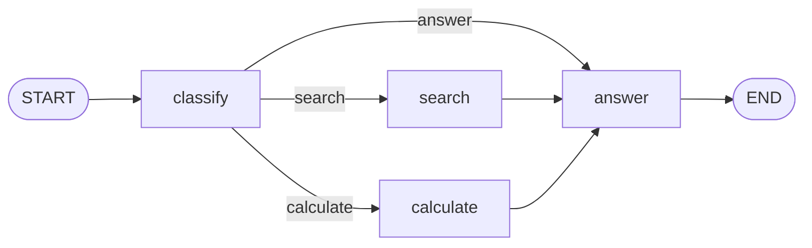
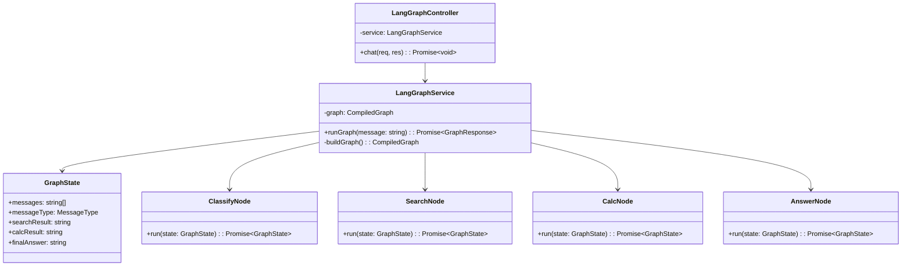
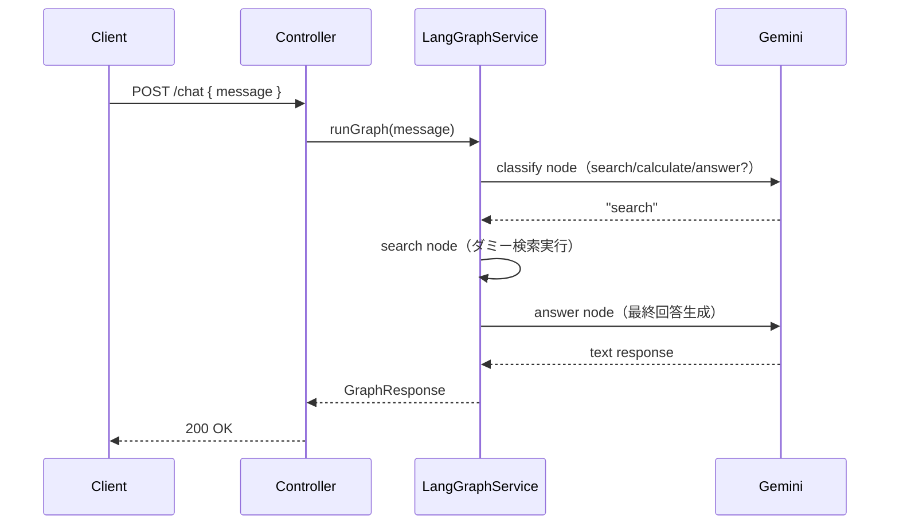

# 外部設計書 - LangGraphエージェント

## 概要

LangGraph.js で状態遷移グラフを構築する。START → classify → [search / calculate / answer] → END の構造。Gemini API と組み合わせて使用。

## 0. 画面モック

```
│ [← Back to Home]  [GitHub Source #79]  [設計書]      │
├──────────────────────────────────────────────────────┤
┌──────────────────────────────────────────────────────┐
│ LangGraphエージェントデモ                              │
├──────────────────────────────────────────────────────┤
│ 質問してください:                                     │
│ ┌────────────────────────────────────────────────┐   │
│ │ 東京の人口について教えてください                │   │
│ └────────────────────────────────────────────────┘   │
│                              [送信する]               │
│                                                      │
│ グラフ実行パス:                                       │
│  START → [classify] → [search] → [answer] → END     │
│           ↓            ↓          ↓                  │
│        "search"    ダミー検索   最終回答生成           │
│                                                      │
│ エージェント応答:                                     │
│ ┌────────────────────────────────────────────────┐   │
│ │ 東京都の人口は約1,400万人です（2024年時点）。   │   │
│ └────────────────────────────────────────────────┘   │
│                                                      │
│ 状態情報:                                             │
│ ┌────────────────────────────────────────────────┐   │
│ │ messageType: "search"                          │   │
│ │ searchResult: "東京都人口: 約1,400万人"         │   │
│ └────────────────────────────────────────────────┘   │
└──────────────────────────────────────────────────────┘
```

## エンドポイント一覧

| メソッド | パス | 説明 |
|---------|------|------|
| POST | /node/agent/langgraph/chat | LangGraph エージェントへの問い合わせ |
| GET | /node/agent/langgraph/health | ヘルスチェック |

### リクエスト / レスポンス

#### POST /node/agent/langgraph/chat

**Request Body**
```json
{
  "message": "東京の人口について教えてください"
}
```

**Response Body**
```json
{
  "reply": "東京都の人口は約 1,400 万人です（2024 年時点）。",
  "graphPath": ["START", "classify", "search", "answer", "END"],
  "state": {
    "messageType": "search",
    "searchResult": "東京都人口: 約 1,400 万人"
  }
}
```

## グラフ構造



## クラス図



## シーケンス図


