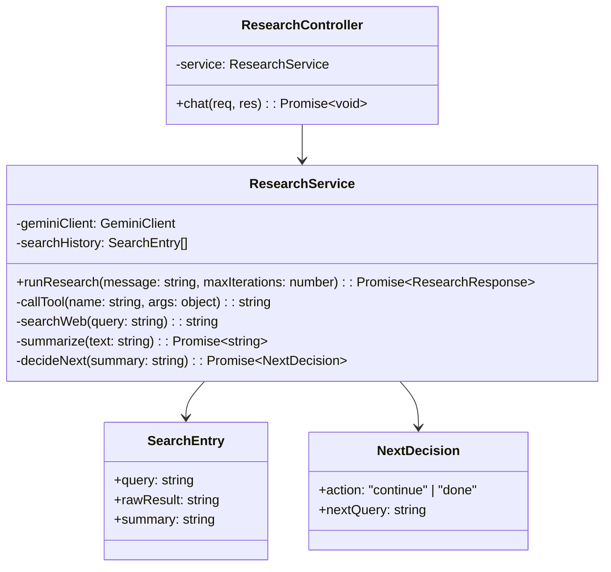
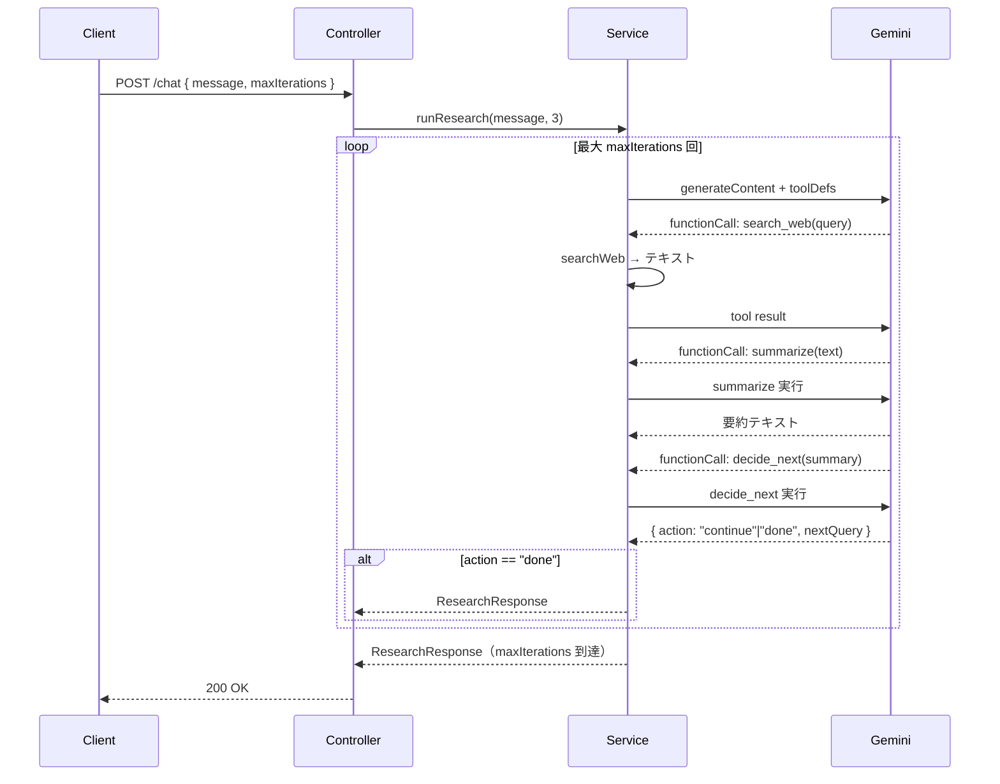

# 外部設計書 - 自律リサーチエージェント

## 概要

search_web（検索）/ summarize（要約）/ decide_next（継続判断）の 3 ツールで最大 5 回の再帰的情報収集を行う自律リサーチエージェント。

## 0. 画面モック

```
│ [← Back to Home]  [GitHub Source #80]  [設計書]      │
├──────────────────────────────────────────────────────┤
┌──────────────────────────────────────────────────────┐
│ 自律リサーチエージェントデモ                           │
├──────────────────────────────────────────────────────┤
│ リサーチテーマを入力してください:                      │
│ ┌────────────────────────────────────────────────┐   │
│ │ TypeScriptの最新バージョンについて調査してください│   │
│ └────────────────────────────────────────────────┘   │
│ 最大反復回数: [3  ▼]                [調査開始]        │
│                                                      │
│ 調査進捗: [██████████░░░░░░░░░░] 2/3回               │
│                                                      │
│ 検索履歴:                                             │
│ ┌────────────────────────────────────────────────┐   │
│ │ [反復1] TypeScript 最新バージョン               │   │
│ │   要約: TypeScript 5.3が最新...                │   │
│ │   判定: continue → 追加調査が必要              │   │
│ ├────────────────────────────────────────────────┤   │
│ │ [反復2] TypeScript 5.3 新機能                  │   │
│ │   要約: Import Attributesサポート...           │   │
│ │   判定: done → 調査完了                        │   │
│ └────────────────────────────────────────────────┘   │
│                                                      │
│ 最終レポート:                                         │
│ ┌────────────────────────────────────────────────┐   │
│ │ TypeScript 5.xのリサーチ結果: 最新は5.3...     │   │
│ └────────────────────────────────────────────────┘   │
└──────────────────────────────────────────────────────┘
```

## エンドポイント一覧

| メソッド | パス | 説明 |
|---------|------|------|
| POST | /node/agent/research/chat | リサーチ開始 |
| GET | /node/agent/research/health | ヘルスチェック |

### リクエスト / レスポンス

#### POST /node/agent/research/chat

**Request Body**
```json
{
  "message": "TypeScript の最新バージョンについて調査してください",
  "maxIterations": 3
}
```

**Response Body**
```json
{
  "reply": "TypeScript 5.x のリサーチ結果をまとめました。...",
  "iterations": 2,
  "searchHistory": [
    { "query": "TypeScript 最新バージョン", "summary": "TypeScript 5.3 が最新..." },
    { "query": "TypeScript 5.3 新機能",    "summary": "Import Attributes サポート..." }
  ]
}
```

## クラス図



## シーケンス図


