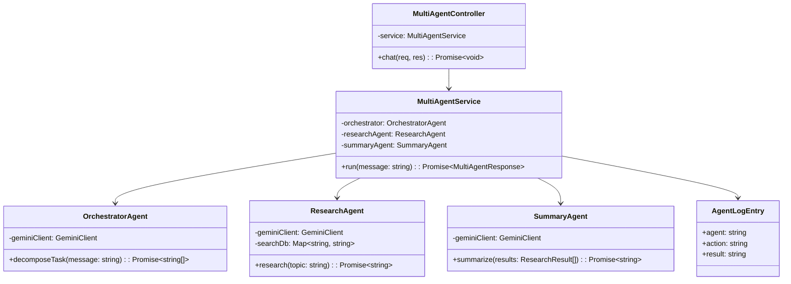
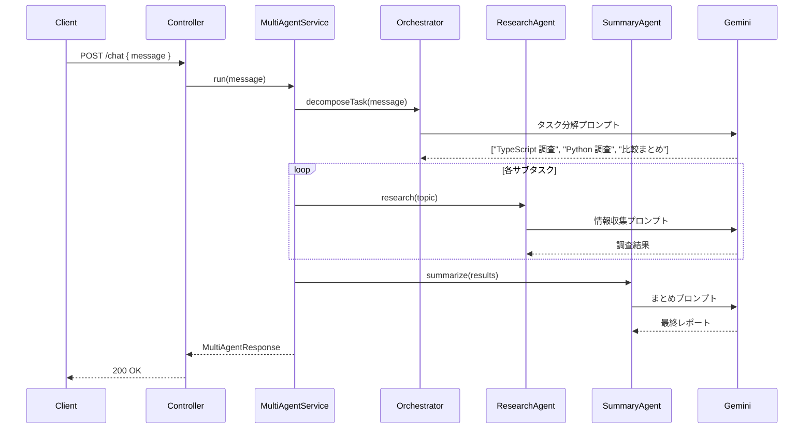

# 外部設計書 - マルチエージェント

## 概要

OrchestratorAgent（タスク分解）/ ResearchAgent（情報収集）/ SummaryAgent（まとめ）の 3 エージェントが協調してタスクを実行するマルチエージェント構成。

## 0. 画面モック

```
│ [← Back to Home]  [GitHub Source #81]  [設計書]      │
├──────────────────────────────────────────────────────┤
┌──────────────────────────────────────────────────────┐
│ マルチエージェントデモ                                 │
├──────────────────────────────────────────────────────┤
│ タスクを入力してください:                              │
│ ┌────────────────────────────────────────────────┐   │
│ │ TypeScriptとPythonの比較レポートを作成してください│   │
│ └────────────────────────────────────────────────┘   │
│                              [実行する]               │
│                                                      │
│ エージェント実行ログ:                                 │
│ ┌────────────────────────────────────────────────┐   │
│ │ [Orchestrator] タスク分解                      │   │
│ │   → ["TypeScript調査","Python調査","比較まとめ"]│   │
│ │ [ResearchAgent] TypeScript調査 ......完了       │   │
│ │ [ResearchAgent] Python調査 .........完了        │   │
│ │ [SummaryAgent]  比較まとめ ..........完了        │   │
│ └────────────────────────────────────────────────┘   │
│                                                      │
│ 最終レポート:                                         │
│ ┌────────────────────────────────────────────────┐   │
│ │ 【TypeScript】静的型付き、コンパイル言語...     │   │
│ │ 【Python】動的型付き、データサイエンスに強い... │   │
│ │ 【比較】用途により選択基準が異なる...           │   │
│ └────────────────────────────────────────────────┘   │
└──────────────────────────────────────────────────────┘
```

## エンドポイント一覧

| メソッド | パス | 説明 |
|---------|------|------|
| POST | /node/agent/multi-agent/chat | マルチエージェントへのタスク送信 |
| GET | /node/agent/multi-agent/health | ヘルスチェック |

### リクエスト / レスポンス

#### POST /node/agent/multi-agent/chat

**Request Body**
```json
{
  "message": "TypeScript と Python の比較レポートを作成してください"
}
```

**Response Body**
```json
{
  "reply": "TypeScript と Python の比較レポートを作成しました。\n\n【TypeScript】...\n【Python】...",
  "agentLog": [
    { "agent": "Orchestrator", "action": "タスク分解", "result": ["TypeScript 調査", "Python 調査", "比較まとめ"] },
    { "agent": "ResearchAgent", "action": "TypeScript 調査", "result": "..." },
    { "agent": "ResearchAgent", "action": "Python 調査", "result": "..." },
    { "agent": "SummaryAgent",  "action": "比較まとめ", "result": "最終レポートテキスト" }
  ]
}
```

## クラス図



## シーケンス図


