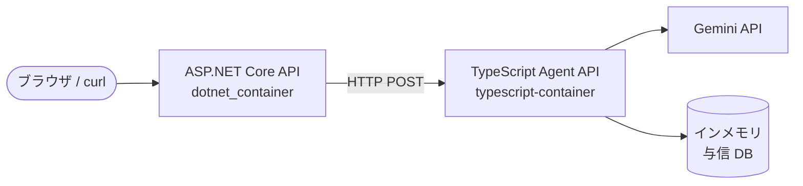
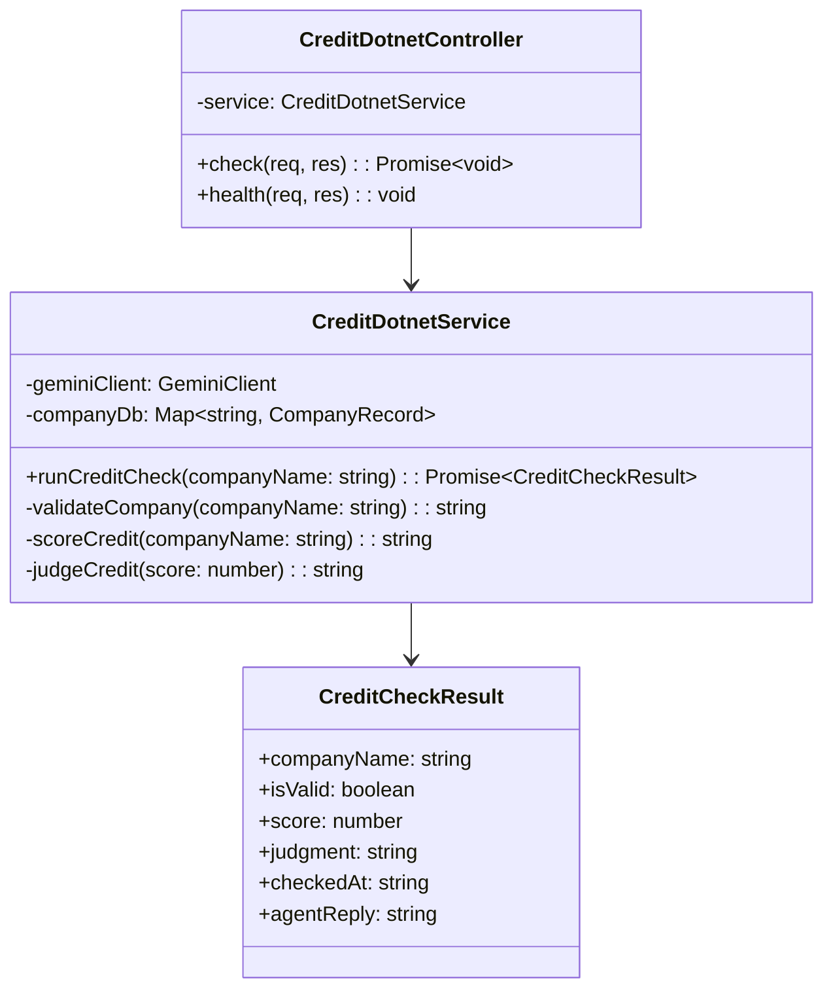
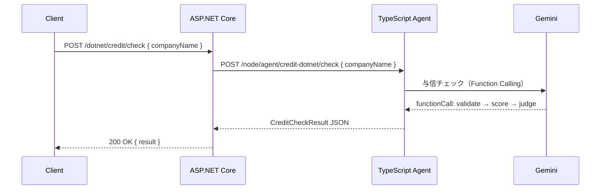

# 外部設計書 - 与信チェック + dotnet 連携

## 概要

TypeScript エージェント API（06-credit-check を拡張）を ASP.NET Core の HttpClient から呼び出す構成。dotnet 側からエンドポイントを叩いてエージェント結果を取得する。

## 0. 画面モック

```
│ [← Back to Home]  [GitHub Source #82]  [設計書]      │
├──────────────────────────────────────────────────────┤
┌──────────────────────────────────────────────────────┐
│ 与信チェック + dotnet連携デモ                          │
├──────────────────────────────────────────────────────┤
│ システム構成:                                         │
│                                                      │
│  [ブラウザ/curl]                                      │
│       ↓  POST /dotnet/credit/check                   │
│  [ASP.NET Core API]  ←── dotnet_container           │
│       ↓  POST /node/agent/credit-dotnet/check        │
│  [TypeScript Agent]  ←── typescript-container       │
│       ↓  Function Calling                            │
│  [Gemini API]                                        │
│                                                      │
│ dotnet側リクエスト:                                   │
│ ┌────────────────────────────────────────────────┐   │
│ │ 会社名: [株式会社サンプル      ]               │   │
│ │                          [与信チェック実行]    │   │
│ └────────────────────────────────────────────────┘   │
│                                                      │
│ 与信チェック結果:                                     │
│ ┌────────────────────────────────────────────────┐   │
│ │ 会社名: 株式会社サンプル                        │   │
│ │ 有効性: ✓ 有効                                 │   │
│ │ スコア: 75点  ██████████░░░░░░░░░░             │   │
│ │ 判定:  承認                                    │   │
│ │ チェック日時: 2025-01-15T10:00:00Z             │   │
│ └────────────────────────────────────────────────┘   │
└──────────────────────────────────────────────────────┘
```

## システム構成図



## エンドポイント一覧

### TypeScript 側（typescript-container）

| メソッド | パス | 説明 |
|---------|------|------|
| POST | /node/agent/credit-dotnet/check | 与信チェック API（dotnet 向け拡張） |
| GET | /node/agent/credit-dotnet/health | ヘルスチェック |

### dotnet 側（dotnet_container）

| メソッド | パス | 説明 |
|---------|------|------|
| POST | /dotnet/credit/check | dotnet 経由で TypeScript エージェントを呼び出す |

## TypeScript API リクエスト / レスポンス

#### POST /node/agent/credit-dotnet/check

**Request Body**
```json
{
  "companyName": "株式会社サンプル"
}
```

**Response Body**
```json
{
  "companyName": "株式会社サンプル",
  "isValid": true,
  "score": 75,
  "judgment": "承認",
  "checkedAt": "2025-01-15T10:00:00.000Z",
  "agentReply": "株式会社サンプルの与信チェック結果：スコア 75 点、判定「承認」です。"
}
```

## クラス図



## シーケンス図（dotnet → TypeScript フロー）


