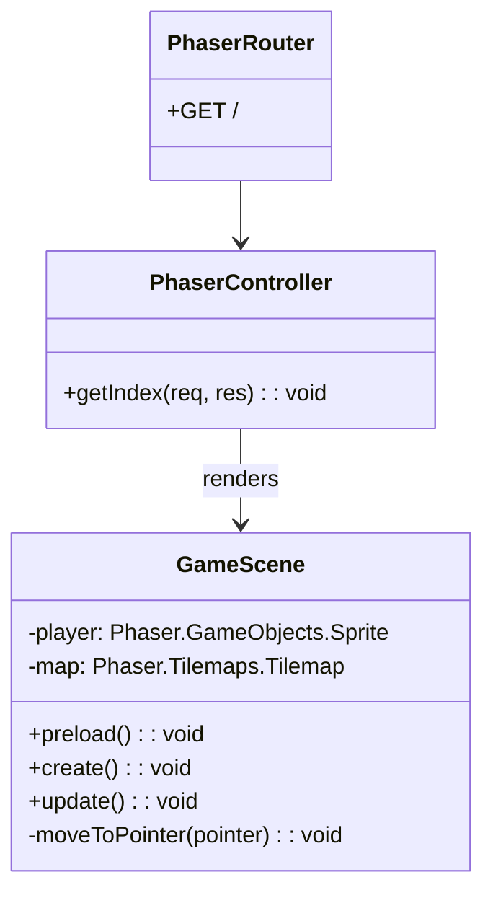
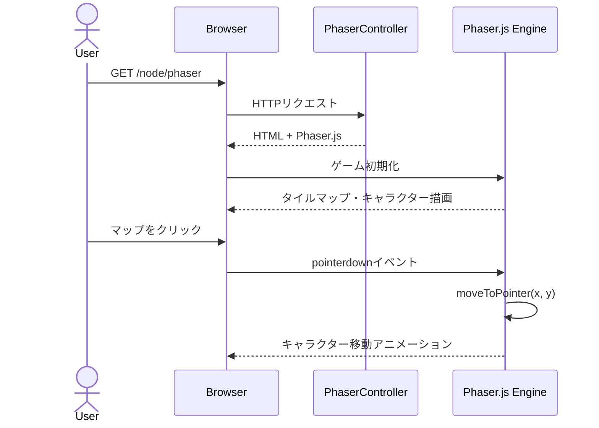

# Phaser.js #01 タイルマップデモ - 外部設計書

## 文書情報
- **作成日**: 2026-03-30
- **最終更新**: 2026-03-30
- **バージョン**: 1.0
- **ステータス**: 設計中

---

## 0. 画面モック

```
┌──────────────────────────────────────────────────────┐
│ Phaser.js デモ - タイルマップ & キャラクター移動        │
├──────────────────────────────────────────────────────┤
│                                                      │
│  ┌──────────────────────────────────────────────┐   │
│  │🌿🌿🌿🌿🌿🌿🌿🌿🌿🌿🌿🌿🌿🌿🌿🌿🌿🌿│   │
│  │🌿　　　　　　　　　　　　　　　　🌿│   │
│  │🌿　　　　　　🧍　　　　　　　　　🌿│   │
│  │🌿　　　　　　　　　　　　　　　　🌿│   │
│  │🌿🌿🌿🌿🌿🌿🌿🌿🌿🌿🌿🌿🌿🌿🌿🌿🌿🌿│   │
│  └──────────────────────────────────────────────┘   │
│                                                      │
│  クリックした場所にキャラクターが移動します            │
│                                                      │
└──────────────────────────────────────────────────────┘
```

---

## 1. 画面設計

### 1.1 画面一覧

| No | 画面ID | 画面名 | パス | ステータス |
|----|--------|--------|------|----------|
| 01 | PHASER_DEMO | Phaser.jsデモ | /node/phaser | 🚧 実装予定 |

---

### 1.2 画面レイアウト

```
┌──────────────────────────────────────────────────────┐
│ Phaser.js デモ                                        │
├──────────────────────────────────────────────────────┤
│                                                      │
│  ┌──────────────────────────────────────────────┐   │
│  │                                              │   │
│  │           Phaser.js Canvas                   │   │
│  │           (800 x 600px)                      │   │
│  │                                              │   │
│  │  ・タイルマップ表示                            │   │
│  │  ・キャラクタースプライト                      │   │
│  │  ・クリック移動                               │   │
│  │                                              │   │
│  └──────────────────────────────────────────────┘   │
│                                                      │
│  操作説明: マップ上をクリックするとキャラクターが移動   │
│                                                      │
└──────────────────────────────────────────────────────┘
```

---

## 2. API設計

### 2.1 エンドポイント一覧

| No | メソッド | パス | 概要 |
|----|---------|------|------|
| A-01 | GET | /node/phaser | デモ画面を返す |

---

### 2.2 API詳細仕様

#### A-01: デモ画面取得

```
GET /node/phaser
```

**レスポンス**: Phaser.jsを含むHTMLページ

---

## 3. クラス図



---

## 4. シーケンス図



---

## 5. エラーハンドリング

| コード | HTTPステータス | 意味 | 対処方法 |
|-------|--------------|------|---------|
| INTERNAL_ERROR | 500 | サーバーエラー | ログ確認 |

---

## 6. 参考

- [内部設計書](internal-design.md)
- [Phaser.js 公式ドキュメント](https://phaser.io/docs)
- [Phaser.js Tilemap ガイド](https://phaser.io/tutorials/making-your-first-phaser-3-game)
