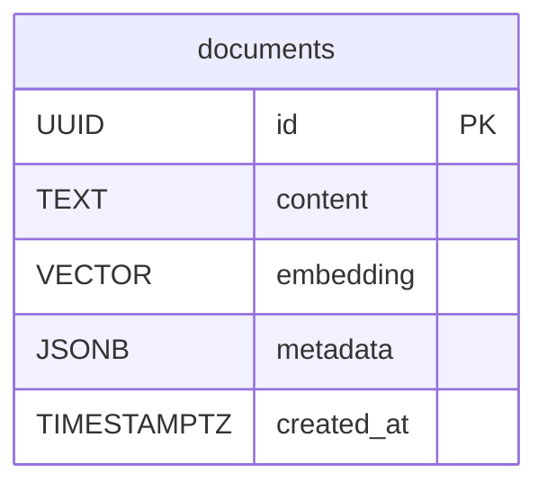
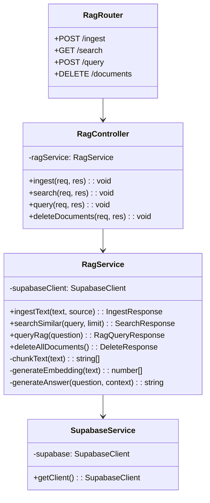
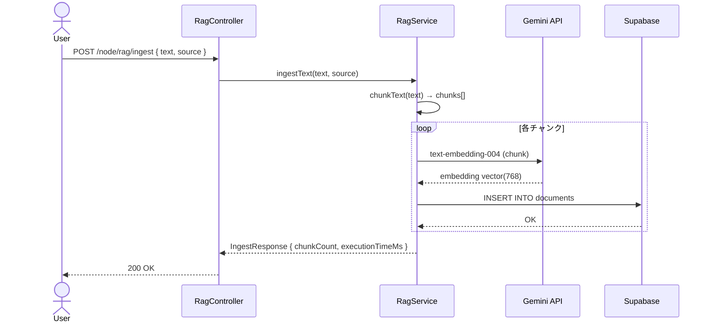
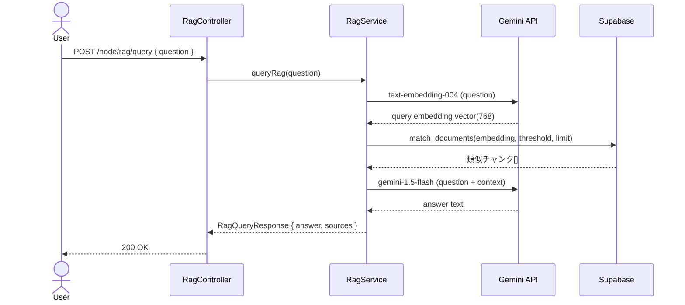

# RAG機能 - 外部設計書

## 文書情報
- **作成日**: 2026-03-13
- **最終更新**: 2026-03-13
- **バージョン**: 1.0
- **ステータス**: 設計中
- **Issue**: [#18](https://github.com/RYA234/typescript-container/issues/18)

---

## 0. 画面モック

```
┌──────────────────────────────────────────────────────┐
│ RAGデモ - 就業規則Q&A (Gemini AI × Supabase)           │
├──────────────────────────────────────────────────────┤
│ Step 1: ドキュメント登録                               │
│ ┌────────────────────────────────────────────────┐   │
│ │ テキスト入力:                                   │   │
│ │ [就業規則・社内規定などを入力してください...   ] │   │
│ │                                                │   │
│ │ 出所ラベル: [就業規則         ]                │   │
│ │                              [登録する]        │   │
│ └────────────────────────────────────────────────┘   │
│ 登録済み: 12チャンク                                  │
│                                                      │
│ Step 2: 類似検索テスト                                 │
│ 検索ワード: [有給休暇        ] [検索]                  │
│                                                      │
│ 検索結果:                                             │
│ ┌────────────────────────────────────────────────┐   │
│ │ 類似度 0.92 | 年次有給休暇は勤続6ヶ月以上...    │   │
│ │ 類似度 0.87 | 有給休暇の申請は3日前までに...    │   │
│ └────────────────────────────────────────────────┘   │
│                                                      │
│ Step 3: 質問応答（RAG）                               │
│ 質問: [有給は何日取れますか？  ] [質問する]            │
│                                                      │
│ 回答:                                                │
│ ┌────────────────────────────────────────────────┐   │
│ │ 年次有給休暇は勤続6ヶ月以上で10日付与されます。 │   │
│ │ 以降は勤続年数に応じて最大20日まで増加します。  │   │
│ └────────────────────────────────────────────────┘   │
│ 参照元: 就業規則 (類似度: 92%) | 処理時間: 1800ms     │
└──────────────────────────────────────────────────────┘
```

---

## 1. 画面設計

### 1.1 画面一覧

| No | 画面ID | 画面名 | パス | ステータス |
|----|--------|--------|------|----------|
| 01 | RAG_DEMO | RAGデモ | /node/rag | 🚧 実装予定 |

---

### 1.2 画面レイアウト

```
┌──────────────────────────────────────────────────────┐
│ RAGデモ - Gemini AI × Supabase                        │
├──────────────────────────────────────────────────────┤
│ Step 1: ドキュメント登録                               │
│ ┌────────────────────────────────────────────────┐   │
│ │ テキスト入力:                                   │   │
│ │ [就業規則・社内規定などを入力してください...   ] │   │
│ │                                                │   │
│ │                    [登録する]                  │   │
│ └────────────────────────────────────────────────┘   │
│ 登録済み: 12チャンク                                  │
│                                                      │
│ Step 2: 類似検索テスト                                 │
│ 検索ワード: [有給休暇        ] [検索]                  │
│                                                      │
│ 検索結果:                                             │
│ ┌────────────────────────────────────────────────┐   │
│ │ 類似度 0.92 | 年次有給休暇は勤続6ヶ月以上...    │   │
│ │ 類似度 0.87 | 有給休暇の申請は3日前までに...    │   │
│ └────────────────────────────────────────────────┘   │
│                                                      │
│ Step 3: 質問応答（RAG）                               │
│ 質問: [有給は何日取れますか？  ] [質問する]            │
│                                                      │
│ 回答:                                                │
│ ┌────────────────────────────────────────────────┐   │
│ │ 年次有給休暇は勤続6ヶ月以上で10日付与されます。 │   │
│ │ 以降は勤続年数に応じて最大20日まで増加します。  │   │
│ └────────────────────────────────────────────────┘   │
└──────────────────────────────────────────────────────┘
```

---

## 2. API設計

### 2.1 エンドポイント一覧

| No | メソッド | パス | 概要 |
|----|---------|------|------|
| A-01 | POST | /node/rag/ingest | ドキュメントを登録・ベクトル化 |
| A-02 | GET | /node/rag/search | 類似検索（ベクトル検索） |
| A-03 | POST | /node/rag/query | 質問応答（RAG） |
| A-04 | DELETE | /node/rag/documents | 登録ドキュメントを全削除 |

---

### 2.2 API詳細仕様

#### A-01: ドキュメント登録

```
POST /node/rag/ingest
Content-Type: application/json
```

**リクエスト**:
```json
{
  "text": "就業規則第○条 年次有給休暇は...",
  "source": "就業規則"
}
```

| パラメータ | 型 | 必須 | 説明 |
|-----------|-----|------|------|
| text | string | ✅ | 登録するテキスト |
| source | string | ❌ | ドキュメントの出所ラベル（デフォルト: "unknown"） |

**レスポンス**:
```json
{
  "success": true,
  "chunkCount": 5,
  "executionTimeMs": 1200,
  "message": "5チャンクを登録しました"
}
```

---

#### A-02: 類似検索

```
GET /node/rag/search?q=有給休暇&limit=3
```

| パラメータ | 型 | 必須 | 説明 |
|-----------|-----|------|------|
| q | string | ✅ | 検索ワード |
| limit | number | ❌ | 取得件数（デフォルト: 3、最大: 10） |

**レスポンス**:
```json
{
  "results": [
    {
      "content": "年次有給休暇は勤続6ヶ月以上の従業員に10日付与されます。",
      "similarity": 0.92,
      "metadata": {
        "source": "就業規則",
        "chunkIndex": 3,
        "totalChunks": 12
      }
    }
  ],
  "executionTimeMs": 320,
  "message": "3件の類似チャンクが見つかりました"
}
```

---

#### A-03: 質問応答（RAG）

```
POST /node/rag/query
Content-Type: application/json
```

**リクエスト**:
```json
{
  "question": "有給は何日取れますか？"
}
```

| パラメータ | 型 | 必須 | 説明 |
|-----------|-----|------|------|
| question | string | ✅ | 質問文 |

**レスポンス**:
```json
{
  "answer": "年次有給休暇は勤続6ヶ月以上で10日付与されます。以降は勤続年数に応じて最大20日まで増加します。",
  "sources": [
    {
      "content": "年次有給休暇は勤続6ヶ月以上の従業員に10日付与されます。",
      "similarity": 0.92,
      "metadata": { "source": "就業規則", "chunkIndex": 3, "totalChunks": 12 }
    }
  ],
  "executionTimeMs": 1800,
  "message": "3件のソースを参照して回答しました"
}
```

---

#### A-04: ドキュメント全削除

```
DELETE /node/rag/documents
```

**レスポンス**:
```json
{
  "success": true,
  "deletedCount": 12,
  "message": "12件のドキュメントを削除しました"
}
```

---

## 3. データモデル（論理）

### 3.1 ER図



---

## 4. クラス図



---

## 5. シーケンス図

### 5.1 ドキュメント登録（Ingest）



---

### 5.2 質問応答（RAG Query）



---

## 6. エラーハンドリング

| コード | HTTPステータス | 意味 | 対処方法 |
|-------|--------------|------|---------|
| MISSING_PARAM | 400 | 必須パラメータなし | パラメータを付与 |
| EMPTY_TEXT | 400 | テキストが空 | テキストを入力 |
| NO_DOCUMENTS | 400 | ドキュメント未登録 | 先にingest APIを呼ぶ |
| GEMINI_ERROR | 502 | Gemini API呼び出し失敗 | APIキー・ネットワーク確認 |
| SUPABASE_ERROR | 502 | Supabase接続失敗 | 接続設定確認 |
| INTERNAL_ERROR | 500 | サーバーエラー | ログ確認 |

---

## 7. 参考

- [内部設計書](internal-design.md)
- [Issue #18](https://github.com/RYA234/typescript-container/issues/18)
- [Gemini Embeddings API](https://ai.google.dev/gemini-api/docs/embeddings)
- [Supabase pgvector](https://supabase.com/docs/guides/ai/vector-columns)
