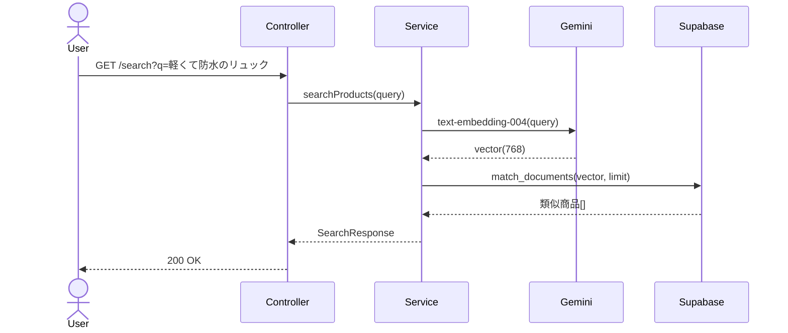
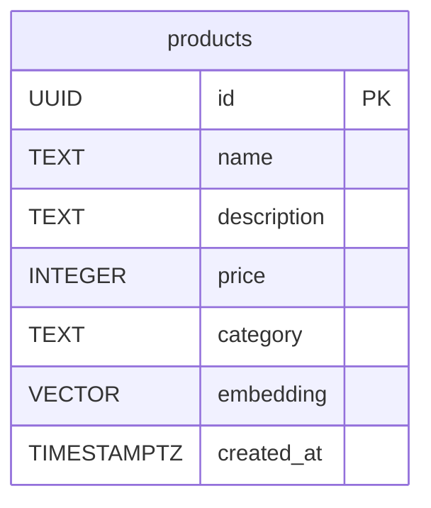

# RAG #02 商品カタログ検索 - 外部設計書

## 文書情報
- **作成日**: 2026-03-13
- **ステータス**: 📝 未着手
- **Issue**: [#54](https://github.com/RYA234/typescript-container/issues/54)
- **ソース**: `src/rag/product/`
- **難易度**: 初級

---

## 環境制約

| エンドポイント種別 | 本番環境（NODE_ENV=production） | 開発環境 |
|------------------|-------------------------------|----------|
| データ登録・削除（POST/DELETE） | **無効**（ルート未登録） | 有効 |
| 検索・参照（GET/POST） | 有効 | 有効 |

> **理由**: 本番環境への意図しないデータ書き込みを防ぐため、`router.ts` で `if (!isProduction)` による制御を実施。
> データ登録は開発環境またはシードスクリプトで行う。

---

## 0. 画面モック

```
┌──────────────────────────────────────────────────────┐
│ 商品カタログ検索デモ                                   │
│ [← Back to Home]  [GitHub Source #54]  [設計書]       │
├──────────────────────────────────────────────────────┤
│ 商品を自然言語で検索してください:                      │
│ ┌────────────────────────────────────────────────┐   │
│ │ 軽くて防水のリュック                            │   │
│ └────────────────────────────────────────────────┘   │
│ 件数: [3  ▼]                        [検索する]       │
│                                                      │
│ 検索結果:                                             │
│ ┌────────────────────────────────────────────────┐   │
│ │ [1] 防水リュック (バッグ)           類似度: 91% │   │
│ │     軽量素材で防水加工済み。通学・登山に最適。  │   │
│ │     価格: ¥5,800                               │   │
│ ├────────────────────────────────────────────────┤   │
│ │ [2] 撥水デイパック (バッグ)         類似度: 85% │   │
│ │     軽量270g、撥水コーティング加工。            │   │
│ │     価格: ¥4,200                               │   │
│ ├────────────────────────────────────────────────┤   │
│ │ [3] アウトドアリュック (アウトドア) 類似度: 78% │   │
│ │     30L大容量、防水素材使用。                   │   │
│ │     価格: ¥8,900                               │   │
│ └────────────────────────────────────────────────┘   │
│ 処理時間: 300ms                                       │
└──────────────────────────────────────────────────────┘
```

---

## 1. 概要

商品説明テキストをベクトル化して保存し、自然言語で類似商品を検索する。

**ユースケース例**
- 「軽くて防水のリュック」→ 類似商品3件を返す
- 「コーヒーに合うお菓子」→ 類似商品を提案

---

## 2. API設計

| メソッド | パス | 概要 |
|---------|------|------|
| POST | /node/rag/product/ingest | 商品データを登録・ベクトル化 |
| GET | /node/rag/product/search?q={query}&limit={n} | 類似商品検索 |

### POST /node/rag/product/ingest

**リクエスト**:
```json
{
  "products": [
    { "name": "防水リュック", "description": "軽量素材で防水加工...", "price": 5800, "category": "バッグ" }
  ]
}
```

**レスポンス**:
```json
{ "success": true, "registeredCount": 10, "executionTimeMs": 2000 }
```

### GET /node/rag/product/search

**レスポンス**:
```json
{
  "results": [
    { "name": "防水リュック", "description": "...", "price": 5800, "similarity": 0.91 }
  ],
  "executionTimeMs": 300
}
```

---

## 3. シーケンス図



---

## 4. データモデル



---

## 5. 参考
- [RAG実装リスト](../../rag-list.md)
- [就業規則Q&A（#01）設計書](../external-design.md)
