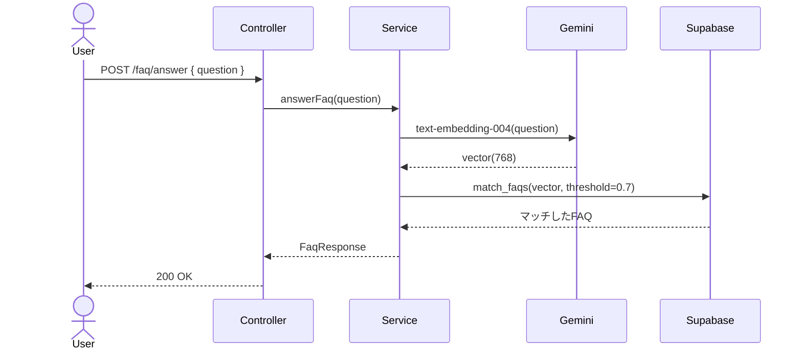
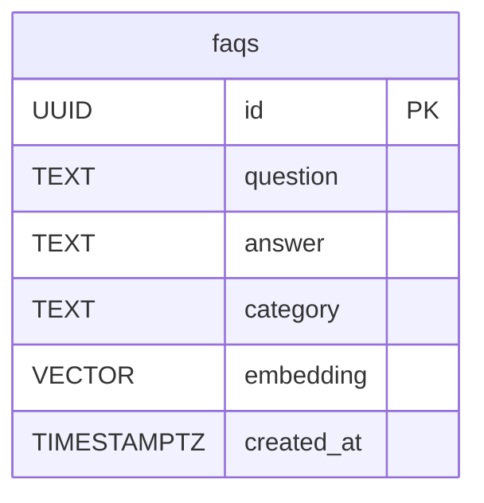

# RAG #03 FAQ自動回答 - 外部設計書

## 文書情報
- **作成日**: 2026-03-13
- **ステータス**: 📝 未着手
- **Issue**: [#55](https://github.com/RYA234/typescript-container/issues/55)
- **ソース**: `src/rag/faq/`
- **難易度**: 初級

---

## 環境制約

| エンドポイント種別 | 本番環境（NODE_ENV=production） | 開発環境 |
|------------------|-------------------------------|----------|
| データ登録・削除（POST/DELETE） | **無効**（ルート未登録） | 有効 |
| 検索・参照（GET/POST） | 有効 | 有効 |

> **理由**: 本番環境への意図しないデータ書き込みを防ぐため、`router.ts` で `if (!isProduction)` による制御を実施。
> データ登録は開発環境またはシードスクリプトで行う。

---

## 0. 画面モック

```
┌──────────────────────────────────────────────────────┐
│ FAQ自動回答デモ                                        │
│ [← Back to Home]  [GitHub Source #55]  [設計書]       │
├──────────────────────────────────────────────────────┤
│ 質問を入力してください:                                │
│ ┌────────────────────────────────────────────────┐   │
│ │ 返品したいんですが...                           │   │
│ └────────────────────────────────────────────────┘   │
│                              [質問する]               │
│                                                      │
│ 回答:                                                 │
│ ┌────────────────────────────────────────────────┐   │
│ │ 購入後30日以内であれば返品可能です。             │   │
│ │ マイページ > 注文履歴から手続きください。         │   │
│ └────────────────────────────────────────────────┘   │
│ マッチしたFAQ: 「返品はできますか？」 (類似度: 89%)   │
│ カテゴリ: 購入 | 処理時間: 350ms                      │
└──────────────────────────────────────────────────────┘
```

---

## 1. 概要

よくある質問と回答をベクトル化して保存し、ユーザーの質問に最も近いFAQを返す。完全一致でなくても意味が近い質問に答えられる。

**ユースケース例**
- 「返品したい」→ 「返品・交換について」のFAQを返す
- 「配送はどれくらいかかる？」→ 「お届けまでの日数」FAQを返す

---

## 2. API設計

| メソッド | パス | 概要 |
|---------|------|------|
| POST | /node/rag/faq/ingest | FAQデータを登録・ベクトル化 |
| POST | /node/rag/faq/answer | 質問に対して最も近いFAQで回答 |

### POST /node/rag/faq/ingest

**リクエスト**:
```json
{
  "faqs": [
    { "question": "返品はできますか？", "answer": "購入後30日以内であれば返品可能です。", "category": "購入" }
  ]
}
```

**レスポンス**:
```json
{ "success": true, "registeredCount": 20, "executionTimeMs": 3000 }
```

### POST /node/rag/faq/answer

**リクエスト**:
```json
{ "question": "返品したいんだけど" }
```

**レスポンス**:
```json
{
  "answer": "購入後30日以内であれば返品可能です。",
  "matchedQuestion": "返品はできますか？",
  "similarity": 0.89,
  "category": "購入",
  "executionTimeMs": 350
}
```

---

## 3. シーケンス図



---

## 4. データモデル



---

## 5. 参考
- [RAG実装リスト](../../rag-list.md)
