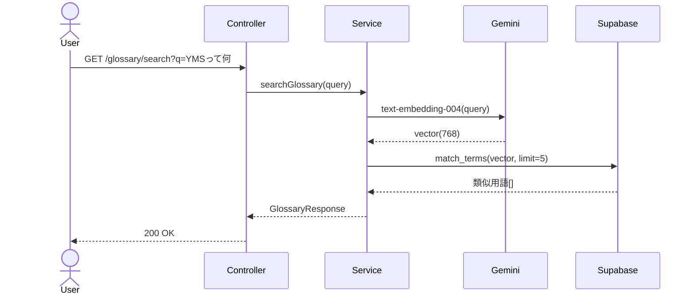
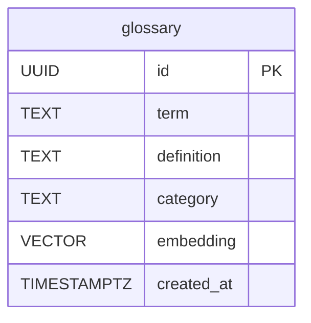

# RAG #04 社内用語集検索 - 外部設計書

## 文書情報
- **作成日**: 2026-03-13
- **ステータス**: 📝 未着手
- **Issue**: [#56](https://github.com/RYA234/typescript-container/issues/56)
- **ソース**: `src/rag/glossary/`
- **難易度**: 初級

---

## 環境制約

| エンドポイント種別 | 本番環境（NODE_ENV=production） | 開発環境 |
|------------------|-------------------------------|----------|
| データ登録・削除（POST/DELETE） | **無効**（ルート未登録） | 有効 |
| 検索・参照（GET/POST） | 有効 | 有効 |

> **理由**: 本番環境への意図しないデータ書き込みを防ぐため、`router.ts` で `if (!isProduction)` による制御を実施。
> データ登録は開発環境またはシードスクリプトで行う。

---

## 0. 画面モック

```
┌──────────────────────────────────────────────────────┐
│ 社内用語集検索デモ                                     │
│ [← Back to Home]  [GitHub Source #56]  [設計書]       │
├──────────────────────────────────────────────────────┤
│ 用語・略語を検索してください:                          │
│ ┌────────────────────────────────────────────────┐   │
│ │ YMSって何？                                    │   │
│ └────────────────────────────────────────────────┘   │
│                              [検索する]               │
│                                                      │
│ 検索結果:                                             │
│ ┌────────────────────────────────────────────────┐   │
│ │ [1] YMS                     類似度: 95%        │   │
│ │     カテゴリ: システム                          │   │
│ │     倉庫管理システム（Yard Management System）  │   │
│ │     入出庫・在庫・ロケーション管理を一元化。    │   │
│ ├────────────────────────────────────────────────┤   │
│ │ [2] WMS                     類似度: 71%        │   │
│ │     カテゴリ: システム                          │   │
│ │     倉庫管理システム（Warehouse Management）    │   │
│ └────────────────────────────────────────────────┘   │
│ 処理時間: 200ms                                       │
└──────────────────────────────────────────────────────┘
```

---

## 1. 概要

社内固有の用語・略語・システム名をベクトル化して保存し、意味や使い方を検索できる。新入社員や異動者が社内用語を素早く調べられる。

**ユースケース例**
- 「YMSって何？」→ 倉庫管理システムの説明を返す
- 「稟議とは」→ 稟議の定義・手順を返す

---

## 2. API設計

| メソッド | パス | 概要 |
|---------|------|------|
| POST | /node/rag/glossary/ingest | 用語データを登録・ベクトル化 |
| GET | /node/rag/glossary/search?q={query} | 用語検索 |

### POST /node/rag/glossary/ingest

**リクエスト**:
```json
{
  "terms": [
    { "term": "YMS", "definition": "倉庫管理システム（Yard Management System）", "category": "システム" }
  ]
}
```

**レスポンス**:
```json
{ "success": true, "registeredCount": 50, "executionTimeMs": 5000 }
```

### GET /node/rag/glossary/search

**レスポンス**:
```json
{
  "results": [
    { "term": "YMS", "definition": "倉庫管理システム...", "category": "システム", "similarity": 0.95 }
  ],
  "executionTimeMs": 200
}
```

---

## 3. シーケンス図



---

## 4. データモデル



---

## 5. 参考
- [RAG実装リスト](../../rag-list.md)
