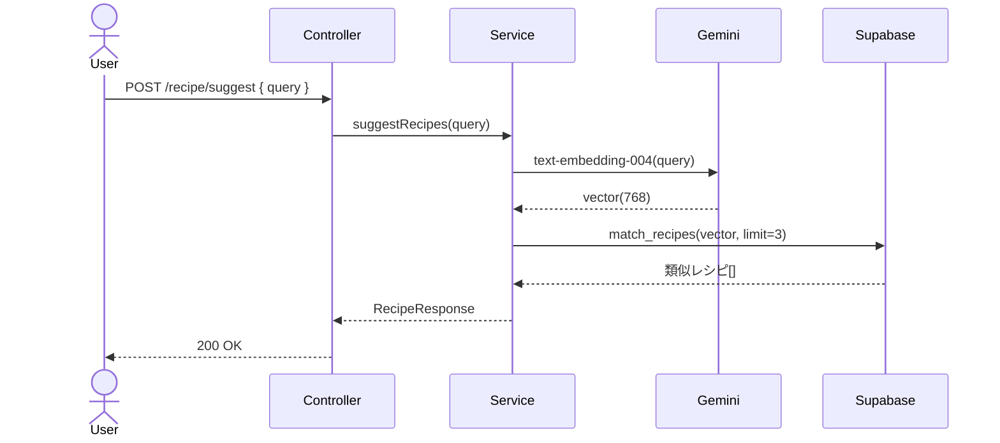
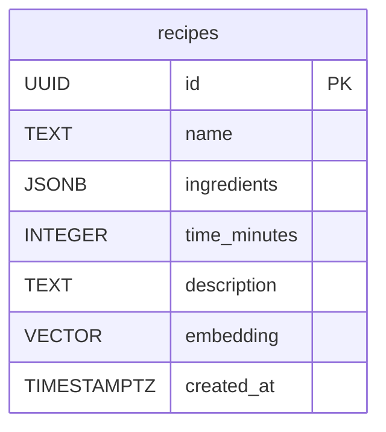

# RAG #05 料理レシピ検索 - 外部設計書

## 文書情報
- **作成日**: 2026-03-13
- **ステータス**: ✅ 実装完了
- **Issue**: [#57](https://github.com/RYA234/typescript-container/issues/57)
- **ソース**: `src/rag/recipe/`
- **難易度**: 初級

---

## 環境制約

| エンドポイント種別 | 本番環境（NODE_ENV=production） | 開発環境 |
|------------------|-------------------------------|----------|
| データ登録・削除（POST/DELETE） | **無効**（ルート未登録） | 有効 |
| 検索・参照（GET/POST） | 有効 | 有効 |

> **理由**: 本番環境への意図しないデータ書き込みを防ぐため、`router.ts` で `if (!isProduction)` による制御を実施。
> データ登録は開発環境またはシードスクリプトで行う。

---

## 0. 画面モック

```
┌──────────────────────────────────────────────────────┐
│ 料理レシピ検索デモ                                     │
│ [← Back to Home]  [GitHub Source #57]  [設計書]       │
├──────────────────────────────────────────────────────┤
│ 食材・気分・条件を入力してください:                    │
│ ┌────────────────────────────────────────────────┐   │
│ │ 鶏肉と玉ねぎで作れる簡単な料理                  │   │
│ └────────────────────────────────────────────────┘   │
│                              [提案する]               │
│                                                      │
│ おすすめレシピ:                                       │
│ ┌────────────────────────────────────────────────┐   │
│ │ [1] 鶏の唐揚げ              類似度: 88%        │   │
│ │     食材: 鶏もも肉, 醤油, 生姜                 │   │
│ │     調理時間: 20分                              │   │
│ ├────────────────────────────────────────────────┤   │
│ │ [2] 鶏肉と玉ねぎの煮物      類似度: 85%        │   │
│ │     食材: 鶏もも肉, 玉ねぎ, だし汁             │   │
│ │     調理時間: 30分                              │   │
│ ├────────────────────────────────────────────────┤   │
│ │ [3] 親子丼                  類似度: 79%        │   │
│ │     食材: 鶏もも肉, 玉ねぎ, 卵, めんつゆ       │   │
│ │     調理時間: 15分                              │   │
│ └────────────────────────────────────────────────┘   │
│ 処理時間: 400ms                                       │
└──────────────────────────────────────────────────────┘
```

---

## 1. 概要

レシピデータをベクトル化して保存し、食材・気分・条件を自然言語で入力して料理を提案する。

**ユースケース例**
- 「鶏肉と玉ねぎで作れるもの」→ 類似レシピを返す
- 「10分で作れる朝ごはん」→ 時短レシピを提案

---

## 2. API設計

| メソッド | パス | 概要 |
|---------|------|------|
| POST | /node/rag/recipe/ingest | レシピデータを登録・ベクトル化 |
| POST | /node/rag/recipe/suggest | 条件に合うレシピを提案 |

### POST /node/rag/recipe/ingest

**リクエスト**:
```json
{
  "recipes": [
    {
      "name": "鶏の唐揚げ",
      "ingredients": ["鶏もも肉", "醤油", "生姜"],
      "time": 20,
      "description": "カリッとジューシーな定番唐揚げ"
    }
  ]
}
```

**レスポンス**:
```json
{ "success": true, "registeredCount": 30, "executionTimeMs": 4000 }
```

### POST /node/rag/recipe/suggest

**リクエスト**:
```json
{ "query": "鶏肉と玉ねぎで作れる簡単な料理" }
```

**レスポンス**:
```json
{
  "suggestions": [
    {
      "name": "鶏の唐揚げ",
      "ingredients": ["鶏もも肉", "醤油", "生姜"],
      "time": 20,
      "similarity": 0.88
    }
  ],
  "executionTimeMs": 400
}
```

---

## 3. シーケンス図



---

## 4. データモデル



---

## 5. 参考
- [RAG実装リスト](../../rag-list.md)
