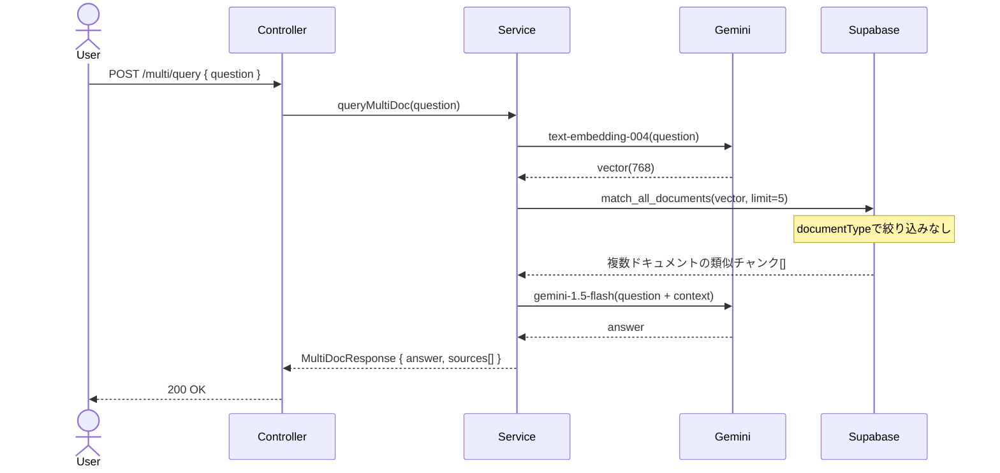
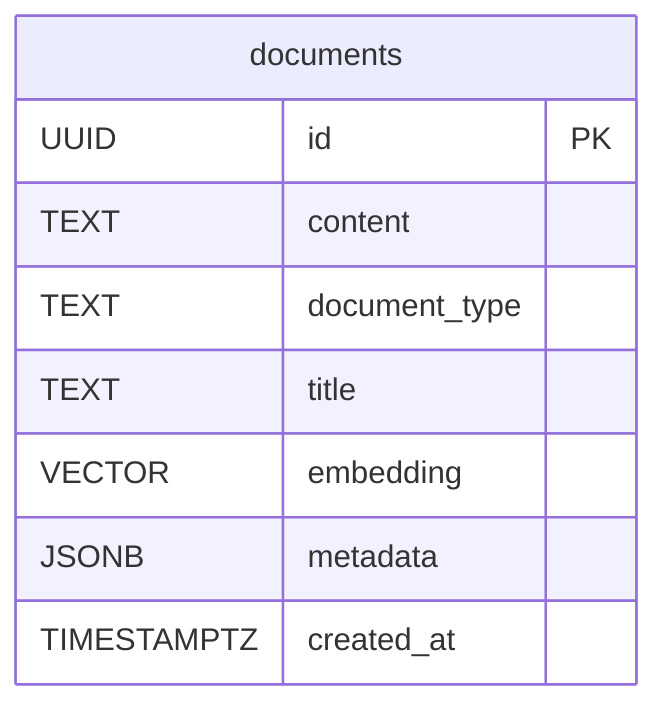

# RAG #06 複数ドキュメント横断検索 - 外部設計書

## 文書情報
- **作成日**: 2026-03-13
- **ステータス**: 📝 未着手
- **Issue**: [#58](https://github.com/RYA234/typescript-container/issues/58)
- **ソース**: `src/rag/multi-doc/`
- **難易度**: 中級

---

## 環境制約

| エンドポイント種別 | 本番環境（NODE_ENV=production） | 開発環境 |
|------------------|-------------------------------|----------|
| データ登録・削除（POST/DELETE） | **無効**（ルート未登録） | 有効 |
| 検索・参照（GET/POST） | 有効 | 有効 |

> **理由**: 本番環境への意図しないデータ書き込みを防ぐため、`router.ts` で `if (!isProduction)` による制御を実施。
> データ登録は開発環境またはシードスクリプトで行う。

---

## 0. 画面モック

```
┌──────────────────────────────────────────────────────┐
│ 複数ドキュメント横断検索デモ                           │
│ [← Back to Home]  [GitHub Source #58]  [設計書]       │
├──────────────────────────────────────────────────────┤
│ ドキュメント種類: [すべて ▼]  (就業規則/マニュアル/議事録)│
│                                                      │
│ 質問:                                                 │
│ ┌────────────────────────────────────────────────┐   │
│ │ 有給の申請方法を教えて                          │   │
│ └────────────────────────────────────────────────┘   │
│                              [質問する]               │
│                                                      │
│ 回答:                                                 │
│ ┌────────────────────────────────────────────────┐   │
│ │ 有給申請は3日前までにシステムから申請してください。│   │
│ │ 上長の承認後、人事部へ自動通知されます。         │   │
│ └────────────────────────────────────────────────┘   │
│                                                      │
│ 参照ドキュメント:                                     │
│ ┌────────────────────────────────────────────────┐   │
│ │ [1] 就業規則 第5章          類似度: 92%        │   │
│ │ [2] 申請マニュアル          類似度: 85%        │   │
│ └────────────────────────────────────────────────┘   │
│ 処理時間: 1800ms                                      │
└──────────────────────────────────────────────────────┘
```

---

## 1. 概要

就業規則・マニュアル・議事録など複数種類のドキュメントを横断検索する。どのドキュメントから回答したかも返す。

**ユースケース例**
- 「有給の申請方法」→ 就業規則 + 申請マニュアルを横断して回答
- 「先月の会議で決まったこと」→ 議事録から検索

---

## 2. API設計

| メソッド | パス | 概要 |
|---------|------|------|
| POST | /node/rag/multi/ingest | ドキュメントをタイプ指定で登録 |
| POST | /node/rag/multi/query | 全ドキュメント横断でRAGクエリ |
| GET | /node/rag/multi/documents | 登録済みドキュメント一覧 |

### POST /node/rag/multi/ingest

**リクエスト**:
```json
{
  "text": "第○条 年次有給休暇は...",
  "documentType": "employment_rules",
  "title": "就業規則 第5章"
}
```

| documentType | 説明 |
|---|---|
| employment_rules | 就業規則 |
| manual | 操作マニュアル |
| minutes | 議事録 |

**レスポンス**:
```json
{ "success": true, "chunkCount": 5, "executionTimeMs": 1200 }
```

### POST /node/rag/multi/query

**リクエスト**:
```json
{ "question": "有給の申請方法を教えて" }
```

**レスポンス**:
```json
{
  "answer": "有給申請は3日前までに...",
  "sources": [
    { "documentType": "employment_rules", "title": "就業規則 第5章", "similarity": 0.92 },
    { "documentType": "manual", "title": "申請マニュアル", "similarity": 0.85 }
  ],
  "executionTimeMs": 1800
}
```

---

## 3. シーケンス図



---

## 4. データモデル



---

## 5. 参考
- [RAG実装リスト](../../rag-list.md)
