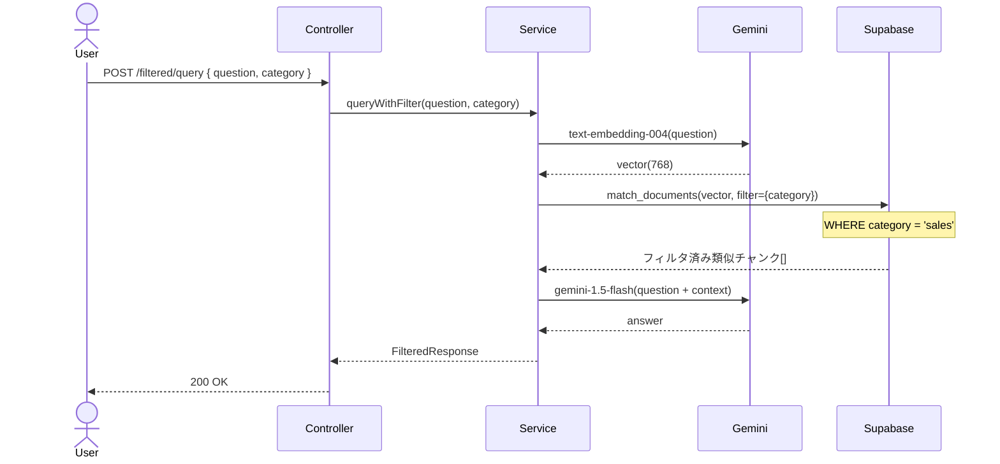
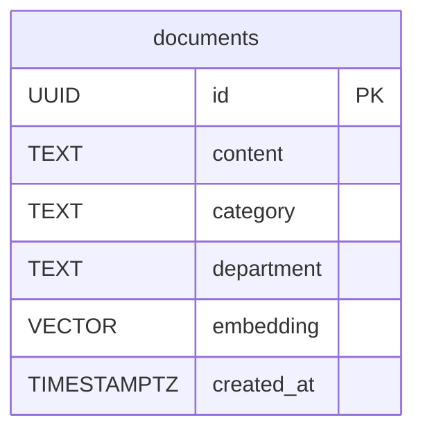

# RAG #07 カテゴリ別フィルタリング - 外部設計書

## 文書情報
- **作成日**: 2026-03-13
- **ステータス**: 📝 未着手
- **Issue**: [#59](https://github.com/RYA234/typescript-container/issues/59)
- **ソース**: `src/rag/category-filter/`
- **難易度**: 中級

---

## 環境制約

| エンドポイント種別 | 本番環境（NODE_ENV=production） | 開発環境 |
|------------------|-------------------------------|----------|
| データ登録・削除（POST/DELETE） | **無効**（ルート未登録） | 有効 |
| 検索・参照（GET/POST） | 有効 | 有効 |

> **理由**: 本番環境への意図しないデータ書き込みを防ぐため、`router.ts` で `if (!isProduction)` による制御を実施。
> データ登録は開発環境またはシードスクリプトで行う。

---

## 0. 画面モック

```
┌──────────────────────────────────────────────────────┐
│ カテゴリ別フィルタリング検索デモ                       │
│ [← Back to Home]  [GitHub Source #59]  [設計書]       │
├──────────────────────────────────────────────────────┤
│ カテゴリ選択:                                         │
│ ( ) すべて  (●) 営業 (sales)  ( ) 人事 (hr)          │
│ ( ) 経理 (accounting)  ( ) IT  ( ) 総務 (general)    │
│                                                      │
│ 部門: [営業部      ]                                  │
│                                                      │
│ 質問:                                                 │
│ ┌────────────────────────────────────────────────┐   │
│ │ 経費精算の上限は？                              │   │
│ └────────────────────────────────────────────────┘   │
│                              [質問する]               │
│                                                      │
│ 回答: [カテゴリ: sales でフィルタ済み]                │
│ ┌────────────────────────────────────────────────┐   │
│ │ 営業部の経費精算上限は月5万円です。             │   │
│ │ 5万円超は事前申請が必要です。                   │   │
│ └────────────────────────────────────────────────┘   │
│ 参照元: 営業部規定 (類似度: 90%) | 処理時間: 400ms    │
└──────────────────────────────────────────────────────┘
```

---

## 1. 概要

部門・カテゴリを指定してベクトル検索の対象を絞り込む。人事部門の規定だけ、営業マニュアルだけ、など部門横断の混在を防ぐ。

**ユースケース例**
- 人事部門のドキュメントのみ検索
- 「営業」カテゴリに限定して類似文書を検索

---

## 2. API設計

| メソッド | パス | 概要 |
|---------|------|------|
| POST | /node/rag/filtered/ingest | カテゴリ付きでドキュメント登録 |
| POST | /node/rag/filtered/query | カテゴリ指定でRAGクエリ |

### POST /node/rag/filtered/ingest

**リクエスト**:
```json
{
  "text": "営業活動における経費精算は...",
  "category": "sales",
  "department": "営業部"
}
```

### POST /node/rag/filtered/query

**リクエスト**:
```json
{
  "question": "経費精算の上限は？",
  "category": "sales"
}
```

**レスポンス**:
```json
{
  "answer": "営業部の経費精算上限は月5万円です。",
  "filteredBy": "sales",
  "sources": [{ "content": "...", "similarity": 0.90 }],
  "executionTimeMs": 400
}
```

---

## 3. シーケンス図



---

## 4. データモデル



---

## 5. 参考
- [RAG実装リスト](../../rag-list.md)
