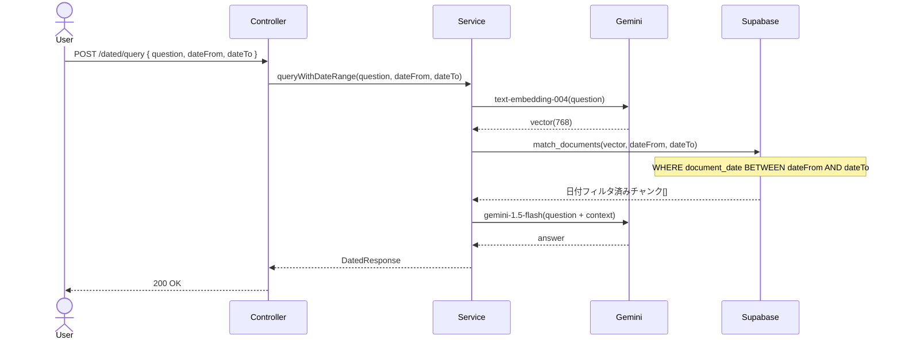
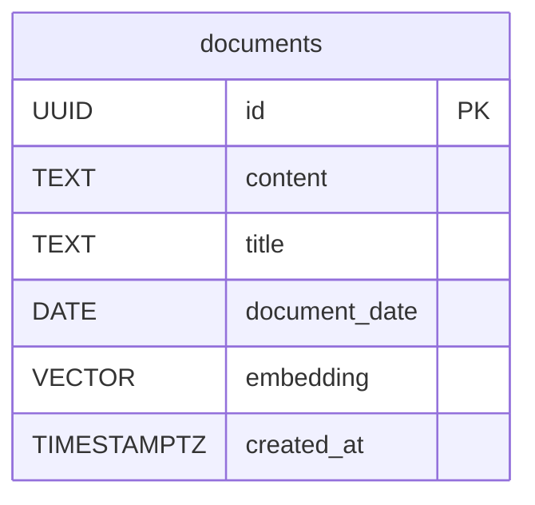

# RAG #08 日付範囲フィルタリング - 外部設計書

## 文書情報
- **作成日**: 2026-03-13
- **ステータス**: 📝 未着手
- **Issue**: [#60](https://github.com/RYA234/typescript-container/issues/60)
- **ソース**: `src/rag/date-filter/`
- **難易度**: 中級

---

## 環境制約

| エンドポイント種別 | 本番環境（NODE_ENV=production） | 開発環境 |
|------------------|-------------------------------|----------|
| データ登録・削除（POST/DELETE） | **無効**（ルート未登録） | 有効 |
| 検索・参照（GET/POST） | 有効 | 有効 |

> **理由**: 本番環境への意図しないデータ書き込みを防ぐため、`router.ts` で `if (!isProduction)` による制御を実施。
> データ登録は開発環境またはシードスクリプトで行う。

---

## 0. 画面モック

```
┌──────────────────────────────────────────────────────┐
│ 日付範囲フィルタリング検索デモ                         │
│ [← Back to Home]  [GitHub Source #60]  [設計書]       │
├──────────────────────────────────────────────────────┤
│ 検索期間:                                             │
│ 開始日: [2026-01-01]  終了日: [2026-12-31]            │
│ ショートカット: [直近1ヶ月] [直近3ヶ月] [今年]         │
│                                                      │
│ 質問:                                                 │
│ ┌────────────────────────────────────────────────┐   │
│ │ 最新の有給ルールは？                            │   │
│ └────────────────────────────────────────────────┘   │
│                              [質問する]               │
│                                                      │
│ 回答: [期間: 2026-01-01 〜 2026-12-31 でフィルタ済み] │
│ ┌────────────────────────────────────────────────┐   │
│ │ 2026年改定の就業規則では、有給休暇は勤続6ヶ月   │   │
│ │ 以上で10日付与されます（2026年3月改定）。       │   │
│ └────────────────────────────────────────────────┘   │
│ 参照元:                                               │
│ ┌────────────────────────────────────────────────┐   │
│ │ 就業規則 2026年改定 (2026-03-01) 類似度: 93%   │   │
│ └────────────────────────────────────────────────┘   │
│ 処理時間: 420ms                                       │
└──────────────────────────────────────────────────────┘
```

---

## 1. 概要

ドキュメントの登録日・更新日で検索範囲を絞り込む。古い情報ではなく最新の規定・情報のみを参照して回答する。

**ユースケース例**
- 「直近1ヶ月の議事録から検索」
- 「2026年以降に更新された規定のみ参照」

---

## 2. API設計

| メソッド | パス | 概要 |
|---------|------|------|
| POST | /node/rag/dated/ingest | 日付付きでドキュメント登録 |
| POST | /node/rag/dated/query | 日付範囲指定でRAGクエリ |

### POST /node/rag/dated/ingest

**リクエスト**:
```json
{
  "text": "2026年3月改定版 就業規則...",
  "title": "就業規則 2026年改定",
  "documentDate": "2026-03-01"
}
```

### POST /node/rag/dated/query

**リクエスト**:
```json
{
  "question": "最新の有給ルールは？",
  "dateFrom": "2026-01-01",
  "dateTo": "2026-12-31"
}
```

**レスポンス**:
```json
{
  "answer": "2026年改定の就業規則では...",
  "dateRange": { "from": "2026-01-01", "to": "2026-12-31" },
  "sources": [
    { "title": "就業規則 2026年改定", "documentDate": "2026-03-01", "similarity": 0.93 }
  ],
  "executionTimeMs": 420
}
```

---

## 3. シーケンス図



---

## 4. データモデル



---

## 5. 参考
- [RAG実装リスト](../../rag-list.md)
