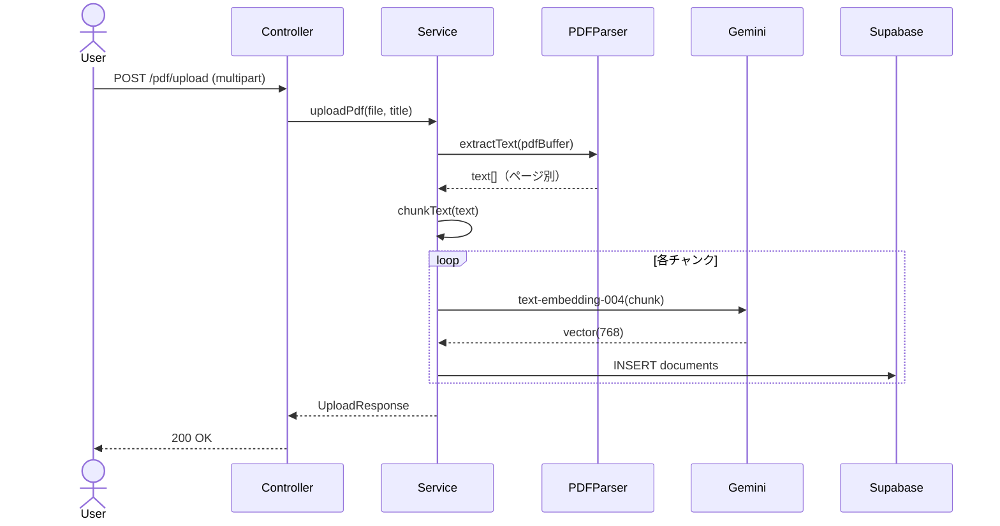
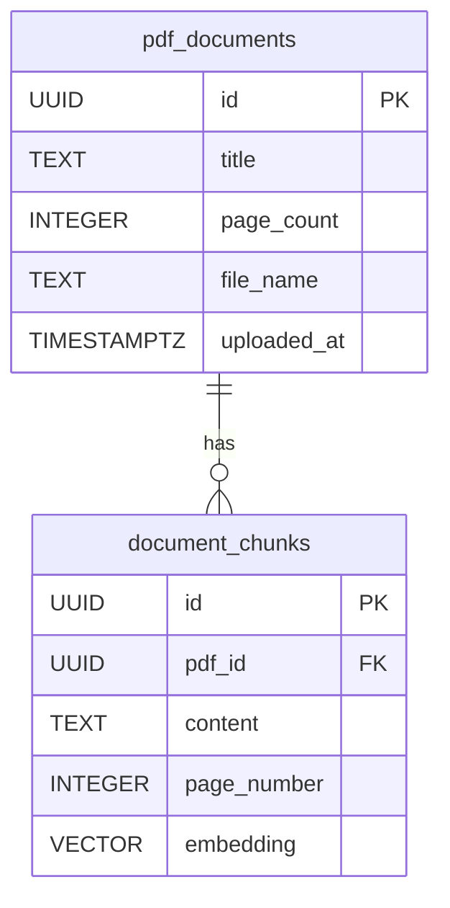

# RAG #09 PDFドキュメント取り込み - 外部設計書

## 文書情報
- **作成日**: 2026-03-13
- **ステータス**: 📝 未着手
- **Issue**: [#61](https://github.com/RYA234/typescript-container/issues/61)
- **ソース**: `src/rag/pdf/`
- **難易度**: 中級

---

## 環境制約

| エンドポイント種別 | 本番環境（NODE_ENV=production） | 開発環境 |
|------------------|-------------------------------|----------|
| データ登録・削除（POST/DELETE） | **無効**（ルート未登録） | 有効 |
| 検索・参照（GET/POST） | 有効 | 有効 |

> **理由**: 本番環境への意図しないデータ書き込みを防ぐため、`router.ts` で `if (!isProduction)` による制御を実施。
> データ登録は開発環境またはシードスクリプトで行う。

---

## 0. 画面モック

```
┌──────────────────────────────────────────────────────┐
│ PDFドキュメント取り込みデモ                            │
│ [← Back to Home]  [GitHub Source #61]  [設計書]       │
├──────────────────────────────────────────────────────┤
│ Step 1: PDFアップロード                               │
│ ┌────────────────────────────────────────────────┐   │
│ │  [PDFファイルをここにドロップ、または選択]       │   │
│ │                                                │   │
│ │  就業規則2026年版.pdf  (1.2 MB)  [削除]        │   │
│ └────────────────────────────────────────────────┘   │
│ タイトル: [就業規則2026年版      ]                    │
│                              [アップロード]           │
│                                                      │
│ アップロード済みPDF:                                  │
│ ┌────────────────────────────────────────────────┐   │
│ │ 就業規則2026年版.pdf  12ページ  48チャンク      │   │
│ │ 製品カタログ2025.pdf   8ページ  32チャンク      │   │
│ └────────────────────────────────────────────────┘   │
│                                                      │
│ Step 2: PDF内容に質問する                             │
│ ┌────────────────────────────────────────────────┐   │
│ │ 育児休業の取得条件は？                          │   │
│ └────────────────────────────────────────────────┘   │
│                              [質問する]               │
│ 回答: 「育児休業は子が1歳に達するまで取得できます。」  │
│ 参照元: 就業規則2026年版 p.8 (類似度: 91%)            │
└──────────────────────────────────────────────────────┘
```

---

## 1. 概要

PDFファイルをアップロードしてテキストを抽出・ベクトル化し、RAGの検索対象として登録する。テキスト入力不要でPDFを直接学習させられる。

**ユースケース例**
- 就業規則のPDFをそのままアップロード
- 製品カタログPDFから仕様を検索

---

## 2. API設計

| メソッド | パス | 概要 |
|---------|------|------|
| POST | /node/rag/pdf/upload | PDFをアップロード・テキスト抽出・ベクトル化 |
| POST | /node/rag/pdf/query | 登録済みPDF内容でRAGクエリ |
| GET | /node/rag/pdf/list | アップロード済みPDF一覧 |

### POST /node/rag/pdf/upload

**リクエスト** (multipart/form-data):
```
file: [PDFファイル]
title: 就業規則2026年版
```

**レスポンス**:
```json
{
  "success": true,
  "title": "就業規則2026年版",
  "pageCount": 12,
  "chunkCount": 48,
  "executionTimeMs": 8000
}
```

### POST /node/rag/pdf/query

**リクエスト**:
```json
{ "question": "育児休業の取得条件は？" }
```

**レスポンス**:
```json
{
  "answer": "育児休業は子が1歳に達するまで取得できます。",
  "sources": [
    { "title": "就業規則2026年版", "page": 8, "similarity": 0.91 }
  ],
  "executionTimeMs": 1600
}
```

---

## 3. シーケンス図



---

## 4. 使用ライブラリ

| ライブラリ | 用途 |
|---|---|
| `pdf-parse` or `pdfjs-dist` | PDFテキスト抽出 |
| `multer` | ファイルアップロード処理 |

---

## 5. データモデル



---

## 6. 参考
- [RAG実装リスト](../../rag-list.md)
