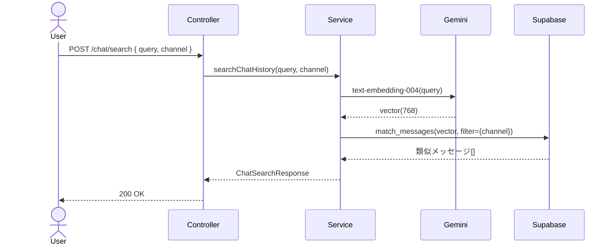
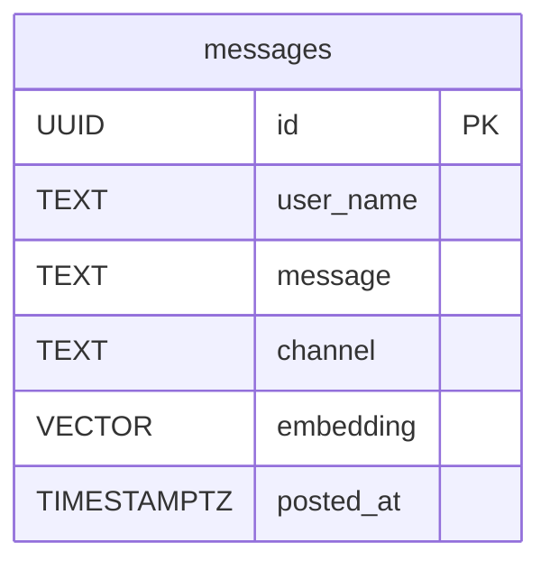

# RAG #10 会話履歴検索 - 外部設計書

## 文書情報
- **作成日**: 2026-03-13
- **ステータス**: 📝 未着手
- **Issue**: [#62](https://github.com/RYA234/typescript-container/issues/62)
- **ソース**: `src/rag/chat-history/`
- **難易度**: 中級

---

## 環境制約

| エンドポイント種別 | 本番環境（NODE_ENV=production） | 開発環境 |
|------------------|-------------------------------|----------|
| データ登録・削除（POST/DELETE） | **無効**（ルート未登録） | 有効 |
| 検索・参照（GET/POST） | 有効 | 有効 |

> **理由**: 本番環境への意図しないデータ書き込みを防ぐため、`router.ts` で `if (!isProduction)` による制御を実施。
> データ登録は開発環境またはシードスクリプトで行う。

---

## 0. 画面モック

```
┌──────────────────────────────────────────────────────┐
│ 会話履歴検索デモ  チャンネル: [release ▼]             │
│ [← Back to Home]  [GitHub Source #62]  [設計書]       │
├──────────────────────────────────────────────────────┤
│ 会話を投稿:                                           │
│ ユーザー名: [Tanaka     ]                             │
│ ┌────────────────────────────────────────────────┐   │
│ │ 本番デプロイ完了しました。バージョン2.1.3です。 │   │
│ └────────────────────────────────────────────────┘   │
│                              [投稿する]               │
│                                                      │
│ 過去の会話を検索:                                     │
│ ┌────────────────────────────────────────────────┐   │
│ │ デプロイに関する会話                            │   │
│ └────────────────────────────────────────────────┘   │
│                              [検索する]               │
│                                                      │
│ 検索結果:                                             │
│ ┌────────────────────────────────────────────────┐   │
│ │ [Tanaka] 2026-03-10 14:30              類似度 88%│  │
│ │ 本番デプロイ完了しました。バージョン2.1.3です。 │   │
│ ├────────────────────────────────────────────────┤   │
│ │ [Suzuki] 2026-03-05 10:15              類似度 82%│  │
│ │ ステージングへのデプロイが終わりました。         │   │
│ └────────────────────────────────────────────────┘   │
│ 処理時間: 300ms                                       │
└──────────────────────────────────────────────────────┘
```

---

## 1. 概要

Slack/Teams風のチャット形式で会話を投稿・蓄積し、過去の会話内容をベクトル検索で取り出す。議事録代わりに使えるナレッジベース。

**ユースケース例**
- 「先月のリリース作業で何を話してた？」→ 過去の会話を検索
- 「デプロイ手順について相談した会話」→ 類似会話を返す

---

## 2. API設計

| メソッド | パス | 概要 |
|---------|------|------|
| POST | /node/rag/chat/post | 会話を投稿・ベクトル化 |
| GET | /node/rag/chat/history | 最新の会話履歴一覧 |
| POST | /node/rag/chat/search | 過去会話をRAGで検索 |

### POST /node/rag/chat/post

**リクエスト**:
```json
{
  "user": "Tanaka",
  "message": "本番デプロイ完了しました。バージョン2.1.3です。",
  "channel": "release"
}
```

**レスポンス**:
```json
{ "success": true, "messageId": "uuid", "executionTimeMs": 800 }
```

### POST /node/rag/chat/search

**リクエスト**:
```json
{ "query": "デプロイに関する会話", "channel": "release", "limit": 5 }
```

**レスポンス**:
```json
{
  "results": [
    {
      "user": "Tanaka",
      "message": "本番デプロイ完了しました。バージョン2.1.3です。",
      "channel": "release",
      "postedAt": "2026-03-10T14:30:00Z",
      "similarity": 0.88
    }
  ],
  "executionTimeMs": 300
}
```

---

## 3. シーケンス図



---

## 4. データモデル



---

## 5. 参考
- [RAG実装リスト](../../rag-list.md)
