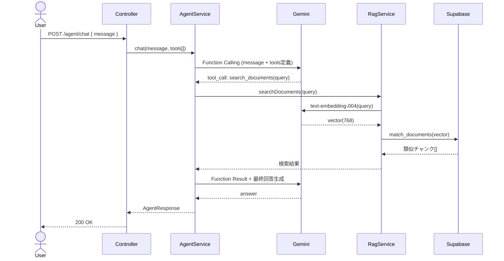

# RAG #11 RAG + エージェント連携 - 外部設計書

## 文書情報
- **作成日**: 2026-03-13
- **ステータス**: 📝 未着手
- **Issue**: [#63](https://github.com/RYA234/typescript-container/issues/63)
- **ソース**: `src/rag/rag-agent/`
- **難易度**: 上級

---

## 環境制約

| エンドポイント種別 | 本番環境（NODE_ENV=production） | 開発環境 |
|------------------|-------------------------------|----------|
| データ登録・削除（POST/DELETE） | **無効**（ルート未登録） | 有効 |
| 検索・参照（GET/POST） | 有効 | 有効 |

> **理由**: 本番環境への意図しないデータ書き込みを防ぐため、`router.ts` で `if (!isProduction)` による制御を実施。
> データ登録は開発環境またはシードスクリプトで行う。

---

## 0. 画面モック

```
┌──────────────────────────────────────────────────────┐
│ RAG + エージェント連携デモ                             │
│ [← Back to Home]  [GitHub Source #63]  [設計書]       │
├──────────────────────────────────────────────────────┤
│ 質問:                                                 │
│ ┌────────────────────────────────────────────────┐   │
│ │ 有給の残日数と申請方法を教えて                  │   │
│ └────────────────────────────────────────────────┘   │
│                              [質問する]               │
│                                                      │
│ エージェント処理ログ:                                 │
│ ┌────────────────────────────────────────────────┐   │
│ │ [1] search_documents("有給申請方法")           │   │
│ │     → 「3日前までにシステムから申請...」        │   │
│ │ [2] calculate("20 - 5")                        │   │
│ │     → 「15」                                   │   │
│ └────────────────────────────────────────────────┘   │
│                                                      │
│ 回答:                                                 │
│ ┌────────────────────────────────────────────────┐   │
│ │ 有給申請は3日前までにシステムから申請してください│   │
│ │ 上長の承認が必要です。残日数は15日です。         │   │
│ └────────────────────────────────────────────────┘   │
│ 使用ツール: search_documents, calculate               │
│ 処理時間: 3200ms                                      │
└──────────────────────────────────────────────────────┘
```

---

## 1. 概要

RAG検索をエージェントのツールとして組み込む。エージェントが「RAGで検索するべきか」を自律的に判断し、必要に応じて検索・回答生成を行う。

**ユースケース例**
- 「有給の残日数と申請方法を教えて」→ エージェントがRAG検索と計算ツールを組み合わせて回答
- 複数回の検索が必要な複雑な質問に対応

---

## 2. エージェントのツール定義

| ツール名 | 説明 | 引数 |
|---------|------|------|
| `search_documents` | RAGで社内ドキュメントを検索 | query: string, limit: number |
| `get_current_date` | 現在日時を取得 | - |
| `calculate` | 計算を実行 | expression: string |

---

## 3. API設計

| メソッド | パス | 概要 |
|---------|------|------|
| POST | /node/rag/agent/chat | エージェントに質問 |

### POST /node/rag/agent/chat

**リクエスト**:
```json
{ "message": "有給の申請方法と残日数の計算方法を教えて" }
```

**レスポンス**:
```json
{
  "answer": "有給申請は3日前までに...",
  "toolsUsed": ["search_documents", "calculate"],
  "searchResults": [
    { "content": "年次有給休暇は...", "similarity": 0.91 }
  ],
  "executionTimeMs": 3200
}
```

---

## 4. シーケンス図



---

## 5. 参考
- [RAG実装リスト](../../rag-list.md)
- [AIエージェント実装リスト](../../agent-list.md)
