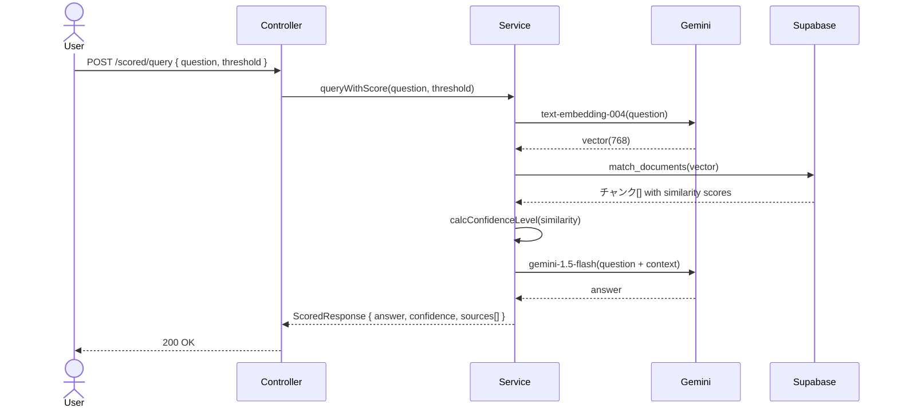

# RAG #12 根拠スコア表示 - 外部設計書

## 文書情報
- **作成日**: 2026-03-13
- **ステータス**: 📝 未着手
- **Issue**: [#64](https://github.com/RYA234/typescript-container/issues/64)
- **ソース**: `src/rag/score-display/`
- **難易度**: 上級

---

## 環境制約

| エンドポイント種別 | 本番環境（NODE_ENV=production） | 開発環境 |
|------------------|-------------------------------|----------|
| データ登録・削除（POST/DELETE） | **無効**（ルート未登録） | 有効 |
| 検索・参照（GET/POST） | 有効 | 有効 |

> **理由**: 本番環境への意図しないデータ書き込みを防ぐため、`router.ts` で `if (!isProduction)` による制御を実施。
> データ登録は開発環境またはシードスクリプトで行う。

---

## 0. 画面モック

```
┌──────────────────────────────────────────────────────┐
│ 根拠スコア表示デモ                                     │
│ [← Back to Home]  [GitHub Source #64]  [設計書]       │
├──────────────────────────────────────────────────────┤
│ 質問:                                                 │
│ ┌────────────────────────────────────────────────┐   │
│ │ 有給は何日取れますか？                          │   │
│ └────────────────────────────────────────────────┘   │
│ 信頼度しきい値: [0.7] (0〜1)        [質問する]        │
│                                                      │
│ 回答:  信頼度: ████████░░ HIGH (0.92)                 │
│ ┌────────────────────────────────────────────────┐   │
│ │ 年次有給休暇は勤続6ヶ月以上で10日付与されます。 │   │
│ │ 以降は勤続年数に応じて最大20日まで増加します。  │   │
│ └────────────────────────────────────────────────┘   │
│                                                      │
│ 参照ソース:                                           │
│ ┌────────────────────────────────────────────────┐   │
│ │ [HIGH] 就業規則 チャンク3   ████████░░  92%    │   │
│ │        年次有給休暇は勤続6ヶ月以上の従業員に... │   │
│ ├────────────────────────────────────────────────┤   │
│ │ [MED]  就業規則 チャンク7   ██████░░░░  78%    │   │
│ │        有給休暇の申請は3日前までに...           │   │
│ └────────────────────────────────────────────────┘   │
│ 処理時間: 1500ms                                      │
└──────────────────────────────────────────────────────┘
```

---

## 1. 概要

RAGの回答に対して「どのドキュメントの何ページを参照したか」「類似度スコアがいくつか」を合わせて表示する。AIの回答の信頼性・根拠を可視化する。

**ユースケース例**
- 回答の横に「参照元: 就業規則P.5 (類似度92%)」を表示
- 類似度が低い場合は「情報が不足している可能性あり」と警告

---

## 2. API設計

| メソッド | パス | 概要 |
|---------|------|------|
| POST | /node/rag/scored/query | スコア付きでRAGクエリ |

### POST /node/rag/scored/query

**リクエスト**:
```json
{ "question": "有給は何日取れますか？", "confidenceThreshold": 0.7 }
```

**レスポンス**:
```json
{
  "answer": "年次有給休暇は勤続6ヶ月以上で10日付与されます。",
  "confidence": "HIGH",
  "sources": [
    {
      "content": "年次有給休暇は勤続6ヶ月以上...",
      "similarity": 0.92,
      "documentTitle": "就業規則",
      "chunkIndex": 3,
      "confidenceLevel": "HIGH"
    }
  ],
  "warning": null,
  "executionTimeMs": 1500
}
```

**信頼度レベル**:
| similarity | confidence | 表示 |
|---|---|---|
| 0.85以上 | HIGH | 緑 |
| 0.7〜0.85 | MEDIUM | 黄 |
| 0.7未満 | LOW | 赤（警告表示） |

---

## 3. シーケンス図



---

## 4. 参考
- [RAG実装リスト](../../rag-list.md)
