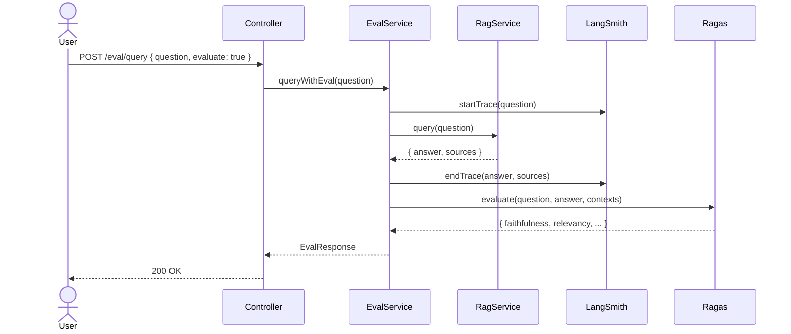

# RAG #13 LangSmith + Ragas評価 - 外部設計書

## 文書情報
- **作成日**: 2026-03-13
- **ステータス**: 📝 未着手
- **Issue**: [#65](https://github.com/RYA234/typescript-container/issues/65)
- **ソース**: `src/rag/langsmith-ragas/`
- **難易度**: 上級

---

## 環境制約

| エンドポイント種別 | 本番環境（NODE_ENV=production） | 開発環境 |
|------------------|-------------------------------|----------|
| データ登録・削除（POST/DELETE） | **無効**（ルート未登録） | 有効 |
| 検索・参照（GET/POST） | 有効 | 有効 |

> **理由**: 本番環境への意図しないデータ書き込みを防ぐため、`router.ts` で `if (!isProduction)` による制御を実施。
> データ登録は開発環境またはシードスクリプトで行う。

---

## 0. 画面モック

```
┌──────────────────────────────────────────────────────┐
│ LangSmith + Ragas 評価デモ                            │
│ [← Back to Home]  [GitHub Source #65]  [設計書]       │
├──────────────────────────────────────────────────────┤
│ 質問:                                                 │
│ ┌────────────────────────────────────────────────┐   │
│ │ 有給は何日取れますか？                          │   │
│ └────────────────────────────────────────────────┘   │
│ [x] 評価スコアを計算する            [質問する]        │
│                                                      │
│ 回答:                                                 │
│ ┌────────────────────────────────────────────────┐   │
│ │ 年次有給休暇は勤続6ヶ月以上で10日付与されます。 │   │
│ └────────────────────────────────────────────────┘   │
│                                                      │
│ 評価スコア:                                           │
│ ┌────────────────────────────────────────────────┐   │
│ │ Faithfulness    ████████░░  0.95  (幻覚なし)   │   │
│ │ Answer Relevancy████████░░  0.88  (関連性高)   │   │
│ │ Context Precision█████████░  0.90 (文脈適切)   │   │
│ │ ─────────────────────────────────────────────  │   │
│ │ 総合スコア      ████████░░  0.91               │   │
│ └────────────────────────────────────────────────┘   │
│ LangSmithトレース: [リンク]  処理時間: 4000ms         │
│                                                      │
│ 一括評価:  [テストセットをアップロード]  [一括評価]    │
└──────────────────────────────────────────────────────┘
```

---

## 1. 概要

RAGの回答品質を定量的に評価・モニタリングする。LangSmithでトレースを記録し、Ragasで評価スコアを算出する。

**評価指標**:
| 指標 | 説明 |
|------|------|
| Faithfulness | 回答がソースに忠実か（幻覚検出） |
| Answer Relevancy | 質問に対して回答が関連しているか |
| Context Precision | 取得したコンテキストが適切か |
| Context Recall | 必要な情報が取得できているか |

---

## 2. API設計

| メソッド | パス | 概要 |
|---------|------|------|
| POST | /node/rag/eval/query | 評価付きでRAGクエリ |
| POST | /node/rag/eval/batch | テストセットで一括評価 |
| GET | /node/rag/eval/metrics | 評価メトリクス一覧取得 |

### POST /node/rag/eval/query

**リクエスト**:
```json
{ "question": "有給は何日取れますか？", "evaluate": true }
```

**レスポンス**:
```json
{
  "answer": "年次有給休暇は勤続6ヶ月以上で10日付与されます。",
  "evaluation": {
    "faithfulness": 0.95,
    "answerRelevancy": 0.88,
    "contextPrecision": 0.90,
    "overallScore": 0.91
  },
  "langsmithTraceUrl": "https://smith.langchain.com/...",
  "executionTimeMs": 4000
}
```

### POST /node/rag/eval/batch

**リクエスト**:
```json
{
  "testSet": [
    { "question": "有給は何日？", "groundTruth": "10日" },
    { "question": "残業の上限は？", "groundTruth": "月45時間" }
  ]
}
```

**レスポンス**:
```json
{
  "results": [...],
  "averageScores": {
    "faithfulness": 0.92,
    "answerRelevancy": 0.87
  },
  "executionTimeMs": 15000
}
```

---

## 3. シーケンス図



---

## 4. 使用ライブラリ・サービス

| ツール | 用途 |
|---|---|
| LangSmith | トレース記録・デバッグ |
| Ragas | RAG評価スコア算出 |
| `langchain` | LangSmith連携 |

---

## 5. 参考
- [RAG実装リスト](../../rag-list.md)
- [LangSmith公式](https://docs.smith.langchain.com)
- [Ragas公式](https://docs.ragas.io)
