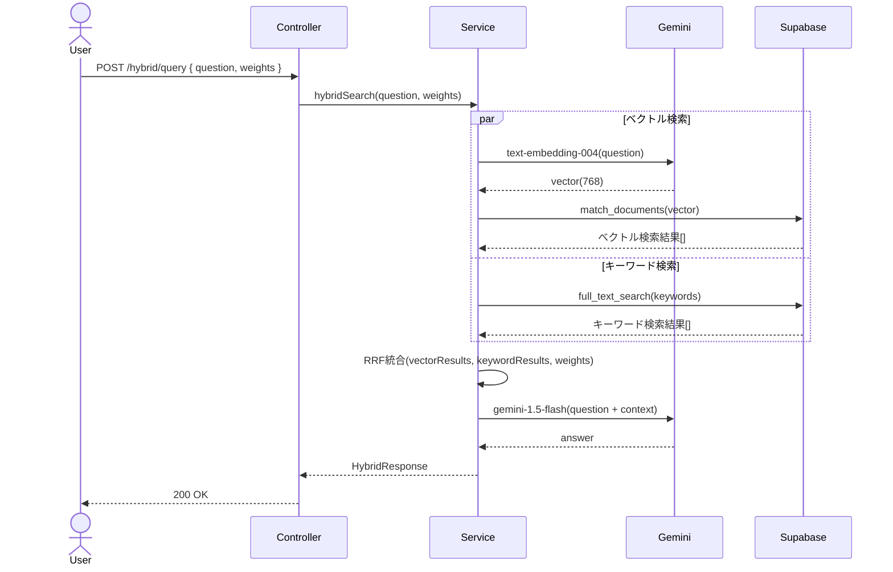

# RAG #14 ハイブリッド検索 - 外部設計書

## 文書情報
- **作成日**: 2026-03-13
- **ステータス**: 📝 未着手
- **Issue**: [#66](https://github.com/RYA234/typescript-container/issues/66)
- **ソース**: `src/rag/hybrid-search/`
- **難易度**: 上級

---

## 環境制約

| エンドポイント種別 | 本番環境（NODE_ENV=production） | 開発環境 |
|------------------|-------------------------------|----------|
| データ登録・削除（POST/DELETE） | **無効**（ルート未登録） | 有効 |
| 検索・参照（GET/POST） | 有効 | 有効 |

> **理由**: 本番環境への意図しないデータ書き込みを防ぐため、`router.ts` で `if (!isProduction)` による制御を実施。
> データ登録は開発環境またはシードスクリプトで行う。

---

## 0. 画面モック

```
┌──────────────────────────────────────────────────────┐
│ ハイブリッド検索デモ                                   │
│ [← Back to Home]  [GitHub Source #66]  [設計書]       │
├──────────────────────────────────────────────────────┤
│ 検索モード:                                           │
│ ( ) ベクトルのみ  ( ) キーワードのみ  (●) ハイブリッド │
│                                                      │
│ 重み設定:                                             │
│ ベクトル [━━━━━━━━━━] 0.5   キーワード [━━━━━━━━━━] 0.5│
│                                                      │
│ 質問:                                                 │
│ ┌────────────────────────────────────────────────┐   │
│ │ モデルXYZ-300の仕様は？                         │   │
│ └────────────────────────────────────────────────┘   │
│                              [検索する]               │
│                                                      │
│ 検索結果 (RRF統合スコア):                             │
│ ┌────────────────────────────────────────────────┐   │
│ │ [1] XYZ-300仕様書           統合スコア: 0.89   │   │
│ │     ベクトル: 0.82  キーワード: 0.95            │   │
│ │     XYZ-300の最大出力は500W、重量3.2kg...       │   │
│ ├────────────────────────────────────────────────┤   │
│ │ [2] XYZ-300取扱説明書       統合スコア: 0.76   │   │
│ │     ベクトル: 0.71  キーワード: 0.82            │   │
│ └────────────────────────────────────────────────┘   │
│ 処理時間: 600ms                                       │
└──────────────────────────────────────────────────────┘
```

---

## 1. 概要

ベクトル検索（意味的類似度）とキーワード検索（全文一致）を組み合わせる。それぞれの弱点を補い合って検索精度を向上させる。

**ベクトル検索 vs キーワード検索**:
| | ベクトル検索 | キーワード検索 |
|---|---|---|
| 強み | 意味が近い文書を発見できる | 完全一致・部分一致が確実 |
| 弱み | 固有名詞・型番に弱い | 言い換え・同義語に弱い |

→ **ハイブリッド**: RRF（Reciprocal Rank Fusion）でスコアを統合

---

## 2. API設計

| メソッド | パス | 概要 |
|---------|------|------|
| POST | /node/rag/hybrid/query | ハイブリッド検索でRAGクエリ |

### POST /node/rag/hybrid/query

**リクエスト**:
```json
{
  "question": "モデルXYZ-300の仕様は？",
  "searchMode": "hybrid",
  "vectorWeight": 0.5,
  "keywordWeight": 0.5
}
```

**レスポンス**:
```json
{
  "answer": "モデルXYZ-300の最大出力は...",
  "sources": [
    {
      "content": "XYZ-300仕様書...",
      "vectorScore": 0.82,
      "keywordScore": 0.95,
      "hybridScore": 0.89
    }
  ],
  "searchMode": "hybrid",
  "executionTimeMs": 600
}
```

---

## 3. シーケンス図



---

## 4. 技術ポイント

**RRF（Reciprocal Rank Fusion）**:
```
score = Σ 1 / (k + rank_i)  (k=60が一般的)
```

ベクトル検索結果とキーワード検索結果をそれぞれランキングし、RRFで統合する。

---

## 5. 参考
- [RAG実装リスト](../../rag-list.md)
